# Cursor Dashboard 界面与权限检查报告

采集日期：2026-09-07（America/Los_Angeles）｜个人 Pro｜19 张截图｜只读检查

## 1. 检查范围与主要结论

本报告对应用户要求的 Cursor Dashboard 检查，基于 Chrome 中当前登录账号 Bohan Xu 的实际页面。采集日期按 America/Los_Angeles 为 2026 年 9 月 7 日；对应 UTC 为 9 月 8 日。逐图时间记录在 evidence/capture-manifest.json。

当前工作区显示个人 Pro，价格为 $20/月。Members 页面显示 Upgrade to Teams，没有呈现团队成员名单或角色配置。本次只能核验个人工作区的现状和页面展示的团队升级能力。

关键状态：Share Data 已启用；Cloud Agents 网络策略为 Allow All Network Access；自托管机器和远程控制均关闭；按需额外付费关闭。Slack 通知开关打开，但 Slack 本身尚未连接。

本次仅进行页面导航、滚动、展开菜单和截图。未改变功能开关，未创建团队、密钥或连接，未撤销会话，也未执行升级、支付或取消订阅。

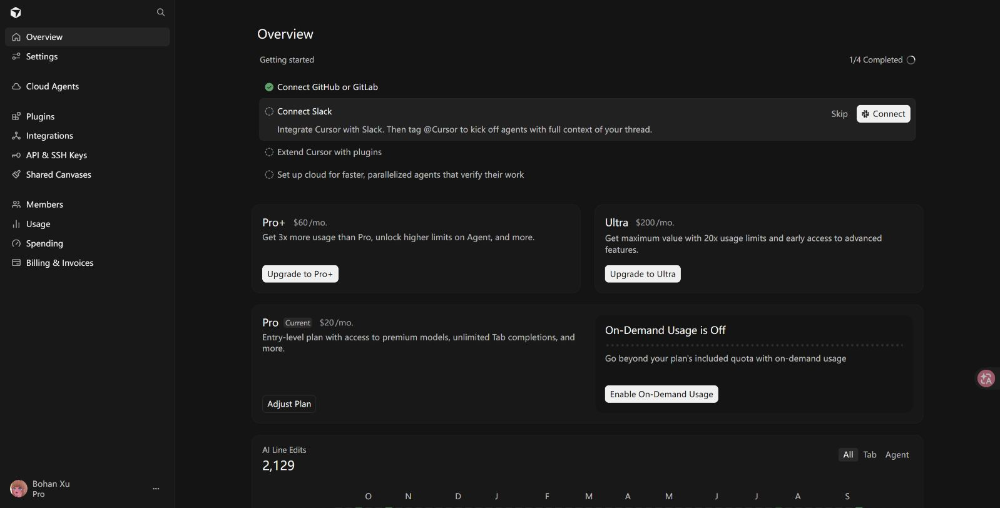

图 01 · 概览：个人 Pro 与按需用量状态｜[原页面](https://cursor.com/dashboard)｜[页面文字记录](evidence/01-overview.txt)

## 2. 隐私、个人资料与会话权限

Share Data 标有 Active。页面说明代码库、提示词、编辑和其他使用数据会被 Cursor 存储并用于训练，以改进产品。Privacy Mode 是另一个可选项，当前未选中；其说明为不用于训练，但 Cloud Agent、Team Rules 等功能可能仍会存储代码。因此不能把 Privacy Mode 等同于所有数据均不落地。

Public profile 处于关闭状态。页面说明，开启后任何持有链接的人都能查看 cursor.com 个人资料页。

Active Sessions 显示 Showing 1–5 of 29，共 29 个会话，第一页展示 5 个 Desktop App 会话。每个会话有 Revoke 按钮，页面提示撤销最多需要 10 分钟。未逐页核验全部设备，也未对这些会话是否异常作判断。

另有 Log Out 和 Delete Account 入口。页面文字记录还显示：主题为 System，浅色主题 Cursor Light、深色主题 Cursor Dark，PR Review Provider 为 GitHub。这些项目见设置页面的文字证据，截图重点覆盖隐私和会话。

| 项目 | 当前状态 | 含义 |
| --- | --- | --- |
| Share Data | 启用 | 页面说明相关数据用于存储与训练 |
| Privacy Mode | 未选中 | 可选择不训练；部分功能仍可能存储代码 |
| Public profile | 关闭 | 未启用持链接公开访问个人资料 |
| Active Sessions | 29 个 | 支持逐个撤销，最多 10 分钟生效 |

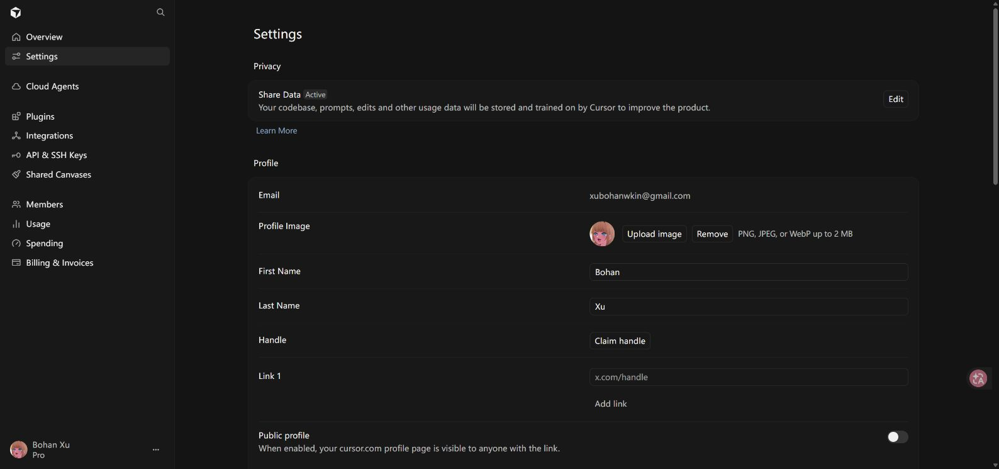

图 02 · 设置：数据共享与公开个人资料｜[原页面](https://cursor.com/dashboard/settings)｜[页面文字记录](evidence/02-settings.txt)

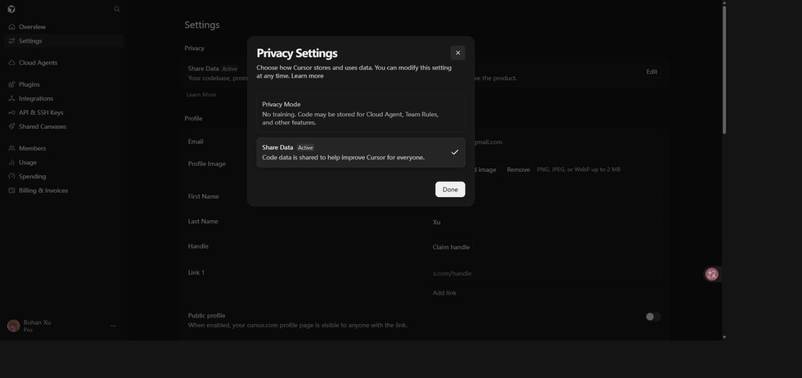

图 03 · 隐私选项：Privacy Mode 与 Share Data｜[原页面](https://cursor.com/dashboard/settings)｜[页面文字记录](evidence/03-privacy-options.txt)

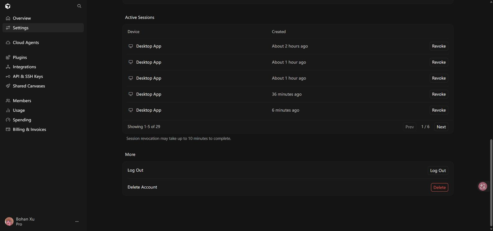

图 19 · 活跃会话与账户操作入口｜[原页面](https://cursor.com/dashboard/settings)｜[页面文字记录](evidence/19-settings-sessions.txt)

## 3. Cloud Agents 功能与执行权限

当前有 1 个 Personal 范围的环境，关联 catbobyman/MultiAgent-Werewolf。页面在 Sep 01–Sep 07 筛选范围内显示 5 次运行、成功率 100%。这些是当前筛选范围的统计，不代表全部历史运行。

自托管机器和远程控制开关均关闭。远程控制的页面说明为：开启后，所有本地 Agent 可通过手机和网页控制。这里只核验开关状态，没有进入机器详情或启动执行。

| 项目 | 当前状态 | 说明 |
| --- | --- | --- |
| Enable Self-hosted Machines | 关闭 | 云代理在自托管机器上的运行入口未开启 |
| Enable Remote Control | 关闭 | 未开启网页/手机对本地 Agent 的控制 |
| Default Model | Claude Sonnet 4.5 | 未指定模型时使用 |
| Default Repository | 未选择 | 显示 Select Repository |
| Base Branch | 未填写 | 页面说明为空时使用仓库默认分支 |
| Branch Prefix | 输入框显示 cursor/ 占位提示 | 不将占位提示当作已保存值 |
| Repository routing | 0 Rules | 没有仓库路由规则 |
| My Secrets | 0 Secrets | 当前列表计数为零 |

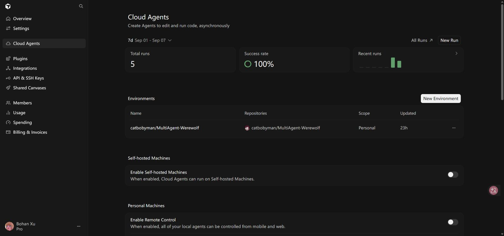

图 04 · 云代理：环境、自托管机器和远程控制｜[原页面](https://cursor.com/dashboard/cloud-agents)｜[页面文字记录](evidence/04-cloud-agents.txt)

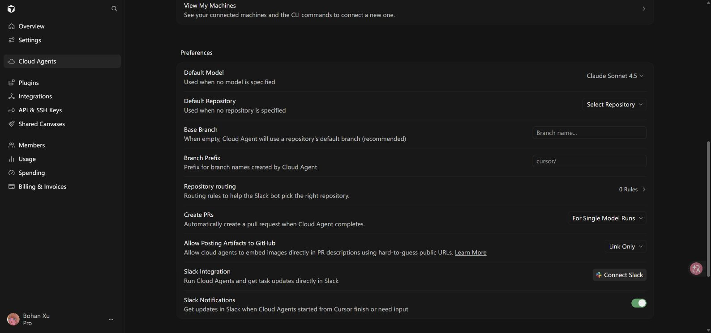

图 05 · 云代理偏好：模型、仓库、PR 和通知｜[原页面](https://cursor.com/dashboard/cloud-agents)｜[页面文字记录](evidence/05-cloud-preferences.txt)

## 4. PR、产物发布、通知与网络策略

Create PRs 当前为 For Single Model Runs，表示单模型运行完成后自动创建 PR；菜单另有 Always 和 Never。该设置涉及自动创建 PR，不代表自动合并权限。

Allow Posting Artifacts to GitHub 当前为 Link Only，另有 Post Artifact。页面说明云代理可通过难以猜测的公开 URL 把图片嵌入 PR 描述。Link Only 是当前发布方式，不能由此推断全部产物链接的访问鉴权机制。

Slack Notifications 开关为开启，但 Slack Integration 仍显示 Connect Slack，因此“通知开关开启”和“集成已配置并可实际收到通知”是两件事。

Network Access Settings 当前为 Allow All Network Access。菜单可选 Defaults + My Allowlist、My Allowlist Only 和 Allow All Network Access。本次没有切换策略，因此未展开其他策略对应的域名列表；无法据此列出默认允许哪些目的地址。

| 设置 | 当前选择 | 可选项/边界 |
| --- | --- | --- |
| Create PRs | For Single Model Runs | Always / For Single Model Runs / Never |
| GitHub 产物发布 | Link Only | Post Artifact / Link Only |
| Slack Notifications | 开启 | Slack 尚未连接 |
| Network Access | Allow All Network Access | Defaults + My Allowlist / My Allowlist Only / Allow All Network Access |

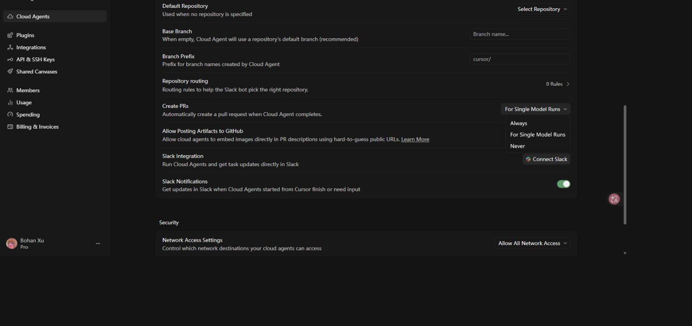

图 06 · 自动创建 PR 的三个选项｜[原页面](https://cursor.com/dashboard/cloud-agents)｜[页面文字记录](evidence/06-pr-options.txt)

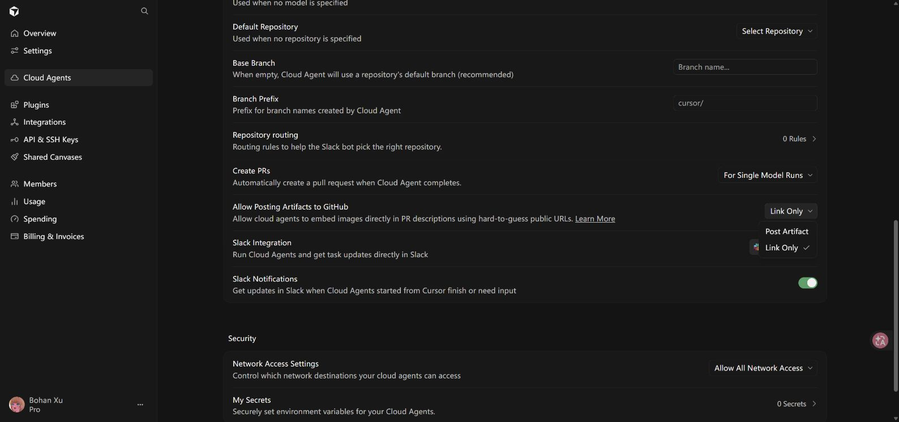

图 07 · GitHub 产物发布选项｜[原页面](https://cursor.com/dashboard/cloud-agents)｜[页面文字记录](evidence/07-artifact-options.txt)

图 08 · 云代理安全：网络访问、通知和 Secrets｜[原页面](https://cursor.com/dashboard/cloud-agents)｜[页面文字记录](evidence/08-cloud-security.txt)

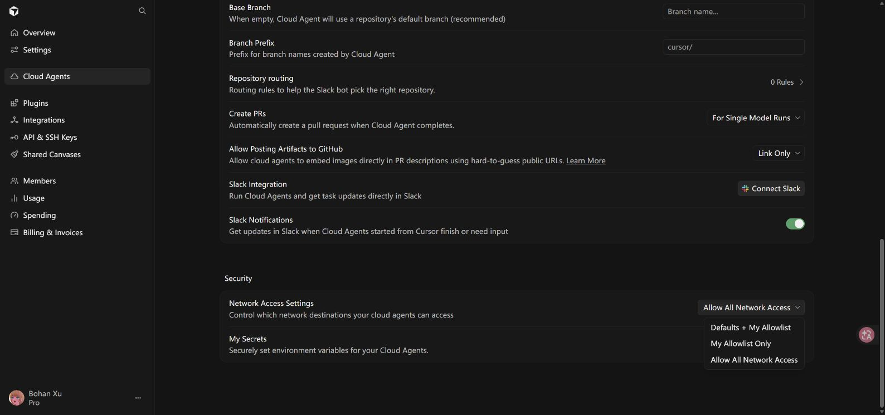

图 09 · 网络访问策略的三个选项｜[原页面](https://cursor.com/dashboard/cloud-agents)｜[页面文字记录](evidence/09-network-options.txt)

## 5. 团队设置与管理员权限边界

Members 页面只显示 Upgrade to Teams、Create team 和 Contact sales。没有展示成员邀请记录、具体角色、管理员名单或权限矩阵。因此不能从当前页面断言某个成员拥有管理员权限，也不能判断某项组织策略已经开启或关闭。

Teams 介绍列出 Team Management（邀请成员、角色与访问管理）、Usage Analytics（团队用量分析）、Admin Controls（集中账单和隐私模式控制）、Rules & Commands（团队共享规则和命令）。

Enterprise 介绍另列出 pooled usage（共享用量池）、SCIM seat management（SCIM 席位管理）和 granular admin controls（更细粒度的管理员控制）。以上属于页面展示的套餐能力，不是当前账号已生效的配置。

若后续进入真实 Teams 工作区，需要另行核验：成员角色及管理员范围、加入/邀请控制、组织级隐私策略、插件强制配置、团队费用上限，以及身份管理配置。当前报告对这些项目统一记为“未核验”，不记为“关闭”。

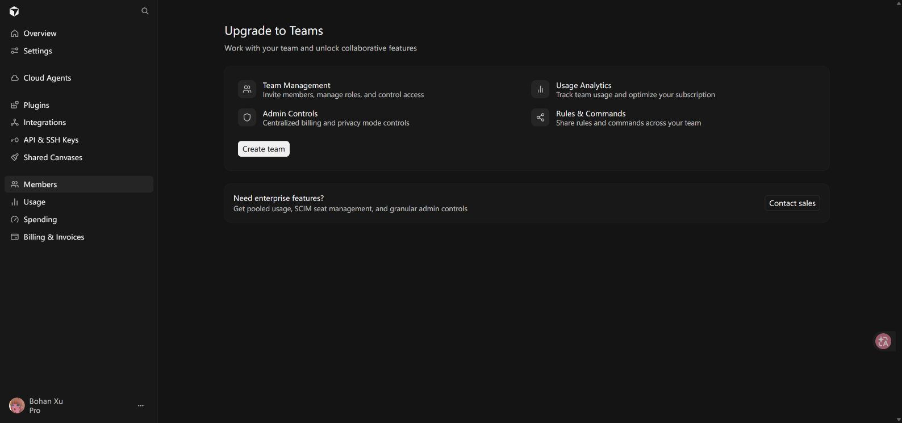

图 10 · 成员页面：Teams 升级与团队能力介绍｜[原页面](https://cursor.com/dashboard/members)｜[页面文字记录](evidence/10-members.txt)

## 6. 第三方集成与代码仓库授权

GitHub 已连接，账号为 catbobyman。控制台文字列出可访问仓库所在的组织 LBP97541135、catbobyman。该文字不等于对这些组织下全部仓库均有访问权。

Manage 菜单提供 Manage in GitHub、Reconnect 和 Disconnect。本次只展开菜单，没有跳转 GitHub 修改安装权限。当前 Cursor 面板没有列出完整仓库范围、OAuth/GitHub App scopes 或具体读写权限。

Slack、Microsoft Teams、Linear 和 Sentry 均显示 Connect。Jira 的 Connect 在加载完成后仍不可用；页面没有说明具体原因，不推断为套餐限制或永久不支持。

| 集成 | 当前状态 | 页面用途 |
| --- | --- | --- |
| GitHub | 已连接 | 代码仓库访问 |
| Slack | 未连接 | 从 Slack 使用 Cloud Agents |
| Microsoft Teams | 未连接 | 从 Teams 使用 Cloud Agents |
| Linear | 未连接 | 把 issue 委派给 Cloud Agents |
| Jira | Connect 不可用 | 页面介绍为 issue 委派 |
| Sentry | 未连接 | 在 Automations 中使用 issue 事件 |

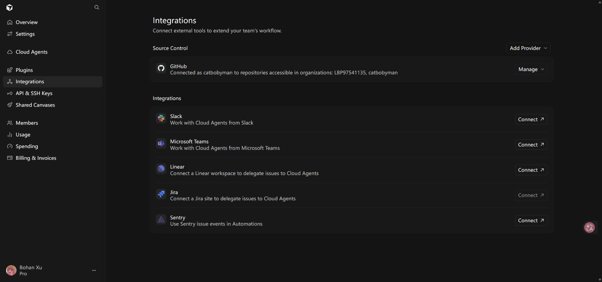

图 11 · 第三方集成连接状态｜[原页面](https://cursor.com/dashboard/integrations)｜[页面文字记录](evidence/11-integrations.txt)

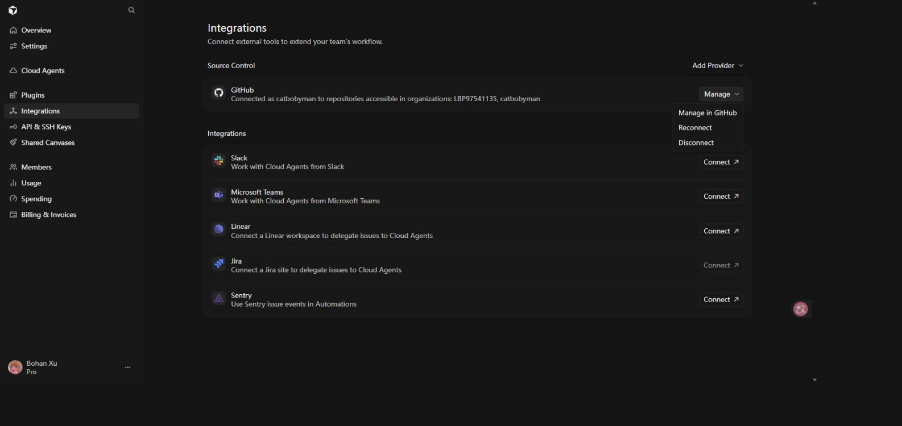

图 12 · GitHub 管理菜单｜[原页面](https://cursor.com/dashboard/integrations)｜[页面文字记录](evidence/12-github-management.txt)

## 7. 插件、API/SSH 密钥与共享访问

Plugins 显示 No Plugins。All、Required、Optional 是列表筛选项，不是三个已开启或关闭的权限开关。Suggested 中的 Google Drive、Google Calendar、Gmail、Granola 是推荐项，不能视为已安装或已授权。

API & SSH Keys 显示 No API Keys Yet 和 No SSH Keys Yet。User API Keys 的页面说明涵盖 Cursor 账号的程序化访问、无界面 Agent CLI 和 Cloud Agent API；本次未创建密钥，因此也没有验证创建时是否提供细粒度 scopes。SSH 密钥说明用于 Origin Codebase 的 SSH 认证访问。

Shared Canvases 显示 No Canvases，当前没有列出的共享画布。本次未创建共享对象，因此未验证创建后的分享对象、链接可见范围和撤销机制。

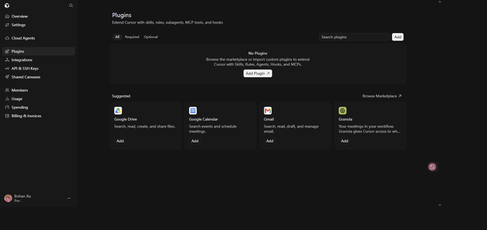

图 13 · 插件：空列表及推荐插件｜[原页面](https://cursor.com/dashboard/plugins)｜[页面文字记录](evidence/13-plugins.txt)

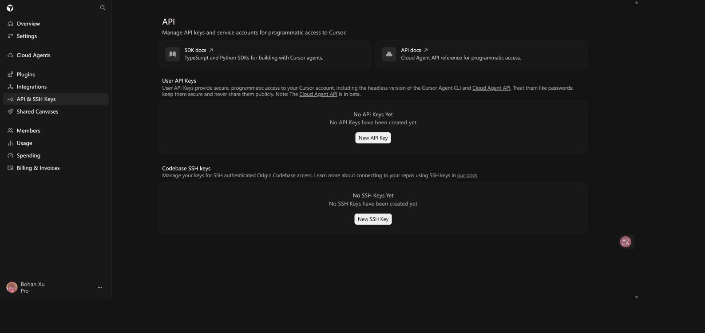

图 14 · API 与 SSH 密钥：均未创建｜[原页面](https://cursor.com/dashboard/api)｜[页面文字记录](evidence/14-api-ssh-keys.txt)

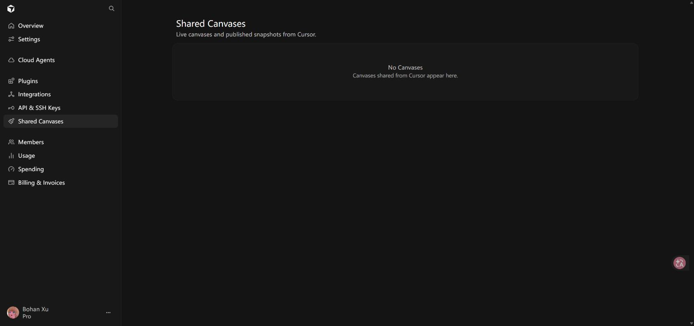

图 15 · 共享画布：空列表｜[原页面](https://cursor.com/dashboard/shared-canvases)｜[页面文字记录](evidence/15-shared-canvases.txt)

## 8. 费用控制、用量与账单

Spending 中 On-Demand Spending 为 Disabled，页面文字明确说明按需花费已禁用；Monthly Limit 也为 Disabled，Save 不可用。Cursor Models、Other Models 和 Grok Bot 周用量均显示约 1%，仅代表截图时状态。

Usage 当前采用 7d 筛选，截图显示 Sep 02–Sep 08、Total tokens 10.6M、Included 10.6M、On-demand 0。表格日期以 UTC 展示。这是当前时间范围统计，不与账单整周期数据混用。页面提供按模型分组和 Export CSV。

Billing & Invoices 显示 Pro $20/月，订阅将于 2026 年 10 月 1 日自动续费；提供 Adjust plan、Manage in Stripe 等入口。页面文字记录还显示 9 月 1 日至 9 月 8 日按需费用为 US$0.00，以及 9 月 1 日一笔 paid、20.00 USD 的发票。未打开 Stripe、发票链接或执行支付操作。

按需用量关闭不等于订阅自动续费关闭；两者在面板中是不同控制。截图 16 展示禁用状态，Monthly Limit 的完整文字记录见同名 evidence 文件。

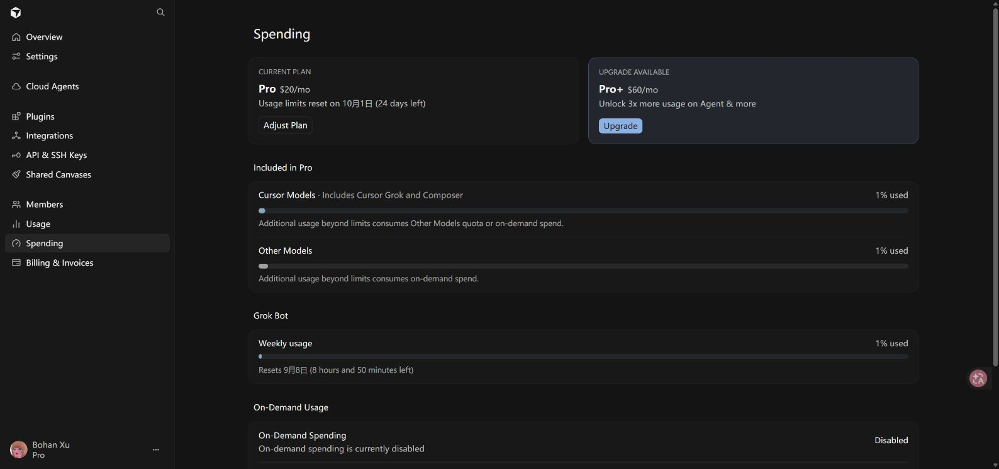

图 16 · 花费控制：按需额外付费已禁用｜[原页面](https://cursor.com/dashboard/spending)｜[页面文字记录](evidence/16-spending.txt)

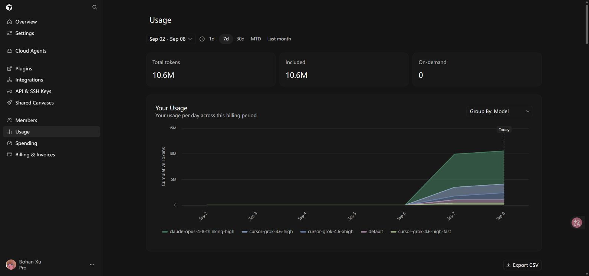

图 17 · 用量：当前 7 天筛选范围｜[原页面](https://cursor.com/dashboard/usage)｜[页面文字记录](evidence/17-usage.txt)

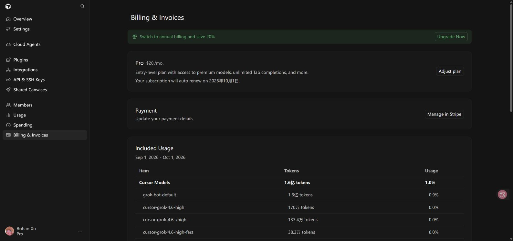

图 18 · 账单：Pro 订阅、续费与支付管理入口｜[原页面](https://cursor.com/dashboard/billing)｜[页面文字记录](evidence/18-billing.txt)

## 9. 证据说明与未核验事项

本报告是当前账号在采集时刻的界面快照。截图采用浏览器原始 JPEG 画面，长页面按关键区域分别采集；没有声称每张均为完整长截图。没有对图片进行内容重绘。浏览器截图曾出现超时和旧画面，相关图片已逐张目视核对并重拍。

每张截图有同名页面文字记录，文字记录可能覆盖截图视口以外的内容。正文已区分截图直接展示的状态、文字记录中的补充信息，以及尚未核验的项目。

未核验事项包括：实际 Teams/Enterprise 权限配置、GitHub 精确仓库及读写授权、其他网络策略的域名清单、插件安装后的权限、API 密钥细粒度 scopes，以及共享画布发布后的访问策略。

本地文件保留账号页面可见信息。账单文字证据中的 Stripe 发票直达地址已替换为省略提示，报告不包含该地址。状态没有因本次报告制作而被修改。

## 截图索引

| 编号 | 截图 | 页面 |
| --- | --- | --- |
| 01 | [概览：个人 Pro 与按需用量状态](screenshots/01-overview.jpg) | [原页面](https://cursor.com/dashboard) |
| 02 | [设置：数据共享与公开个人资料](screenshots/02-settings.jpg) | [原页面](https://cursor.com/dashboard/settings) |
| 03 | [隐私选项：Privacy Mode 与 Share Data](screenshots/03-privacy-options.jpg) | [原页面](https://cursor.com/dashboard/settings) |
| 04 | [云代理：环境、自托管机器和远程控制](screenshots/04-cloud-agents.jpg) | [原页面](https://cursor.com/dashboard/cloud-agents) |
| 05 | [云代理偏好：模型、仓库、PR 和通知](screenshots/05-cloud-preferences.jpg) | [原页面](https://cursor.com/dashboard/cloud-agents) |
| 06 | [自动创建 PR 的三个选项](screenshots/06-pr-options.jpg) | [原页面](https://cursor.com/dashboard/cloud-agents) |
| 07 | [GitHub 产物发布选项](screenshots/07-artifact-options.jpg) | [原页面](https://cursor.com/dashboard/cloud-agents) |
| 08 | [云代理安全：网络访问、通知和 Secrets](screenshots/08-cloud-security.jpg) | [原页面](https://cursor.com/dashboard/cloud-agents) |
| 09 | [网络访问策略的三个选项](screenshots/09-network-options.jpg) | [原页面](https://cursor.com/dashboard/cloud-agents) |
| 10 | [成员页面：Teams 升级与团队能力介绍](screenshots/10-members.jpg) | [原页面](https://cursor.com/dashboard/members) |
| 11 | [第三方集成连接状态](screenshots/11-integrations.jpg) | [原页面](https://cursor.com/dashboard/integrations) |
| 12 | [GitHub 管理菜单](screenshots/12-github-management.jpg) | [原页面](https://cursor.com/dashboard/integrations) |
| 13 | [插件：空列表及推荐插件](screenshots/13-plugins.jpg) | [原页面](https://cursor.com/dashboard/plugins) |
| 14 | [API 与 SSH 密钥：均未创建](screenshots/14-api-ssh-keys.jpg) | [原页面](https://cursor.com/dashboard/api) |
| 15 | [共享画布：空列表](screenshots/15-shared-canvases.jpg) | [原页面](https://cursor.com/dashboard/shared-canvases) |
| 16 | [花费控制：按需额外付费已禁用](screenshots/16-spending.jpg) | [原页面](https://cursor.com/dashboard/spending) |
| 17 | [用量：当前 7 天筛选范围](screenshots/17-usage.jpg) | [原页面](https://cursor.com/dashboard/usage) |
| 18 | [账单：Pro 订阅、续费与支付管理入口](screenshots/18-billing.jpg) | [原页面](https://cursor.com/dashboard/billing) |
| 19 | [活跃会话与账户操作入口](screenshots/19-settings-sessions.jpg) | [原页面](https://cursor.com/dashboard/settings) |
