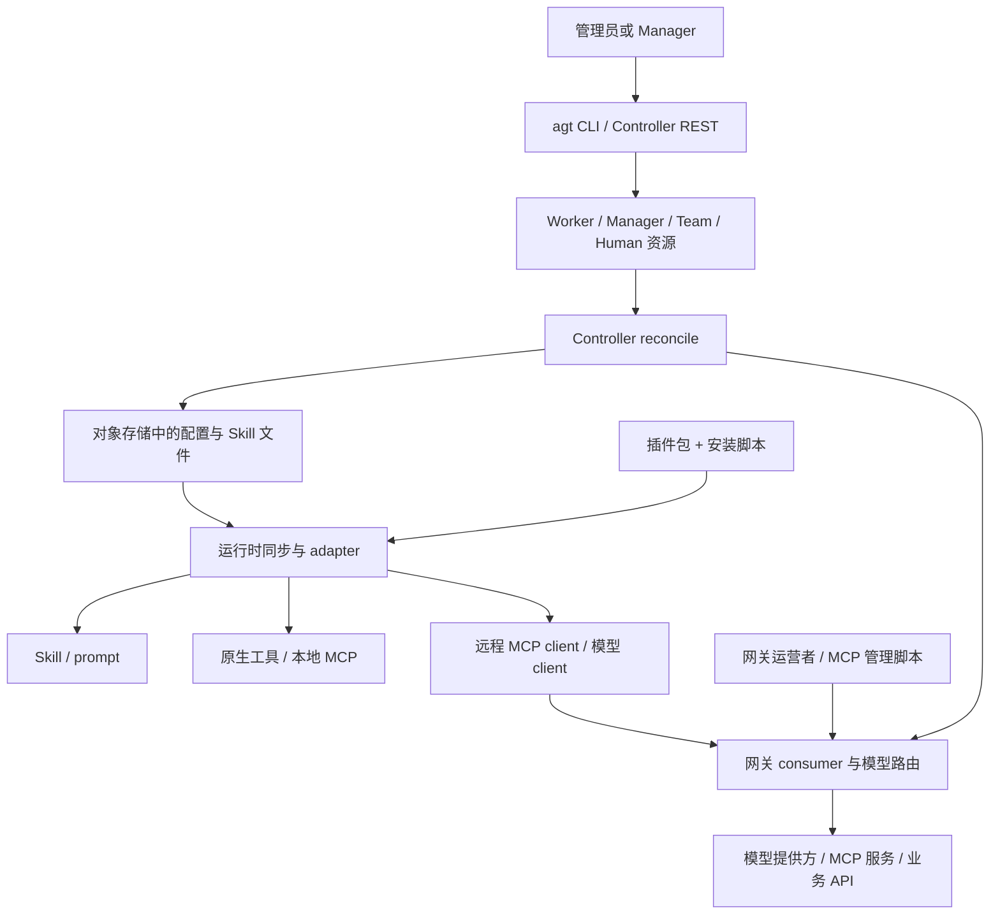

# AgentTeams 的 MCP、Skill、工具、插件与 API 统一管理调研

调研日期：2026-09-12。源码基线为 `third_party/AgentTeams` 的 `517caff9280242a00a4d4c06365352b9e41659c6`，与本仓库来源记录一致；本次开始时上游工作树干净。此 SHA 是本次固定分析对象，不声称是调研当日最新版本。

使用 pstack 的 how、why、unslop 工作流，按 MCP／网关、Skill／插件、Git／PR 历史三个角度只读调查，并由主代理核对 Controller API 和关键跨层行为。GitHub 历史查询使用 agent-reach 的 gh 路由。结论区分源码事实、历史动机和分析归纳；本次未启动 AgentTeams、安装运行依赖、调用真实模型、运行集成测试或重跑 validation 实验。

**主要结论是分层统一。** Controller 汇合 Agent 资源和能力分配，网关管理模型及经它代理的 MCP 访问，插件包组合提示词、Skill 和工具代码，运行时适配器把这些内容接入各自 Agent。没有在本次覆盖的源码中发现一个同时承担五类能力注册、授权、安装、加载和执行的总管理器。这是对下述具体实现的归纳。

| 对象 | 管理的内容 | 声明或存放位置 | 最终执行者 |
| --- | --- | --- | --- |
| MCP | Agent 连接哪些 server；网关另管 server 部署和 consumer 授权 | Worker／Manager 的 `spec.mcpServers`；网关 MCP 配置；runtime MCP client 配置 | mcporter 或运行时原生 MCP client；远端或本地 MCP server |
| Skill | 操作方法、工作流程、脚本及参考文件；指定 Agent 的分配列表 | `spec.skills`、Worker 的 `spec.remoteSkills`、镜像模板、对象存储及运行目录 | Agent 阅读 Skill，并调用已经存在的工具／CLI／脚本 |
| 工具 | 可调用名称、输入 schema、实现函数及局部角色限制 | 运行时 toolkit／Plugin API、MCP server 的工具表 | 各工具实现及其 runtime |
| 插件 | 一起分发和接入的 prompts、skills、MCP、适配器及执行代码 | `plugin.yaml`、本地 `.agentteams/plugins/`、runtime 原生插件目录 | 包生命周期脚本和对应 runtime adapter |
| API | 管理资源、模型推理、业务服务调用及 runtime 本地配置 | Controller REST、AI Gateway、业务后端、runtime HTTP API | 各自 API 服务；部分业务 API 可由网关转换为 MCP |

表中各项的直接依据分别见 [资源字段](https://github.com/agentscope-ai/AgentTeams/blob/517caff9280242a00a4d4c06365352b9e41659c6/agentteams-controller/api/v1beta1/types.go#L178)、[插件清单](https://github.com/agentscope-ai/AgentTeams/blob/517caff9280242a00a4d4c06365352b9e41659c6/plugins/teamharness/plugin.yaml#L1)、[工具分派](https://github.com/agentscope-ai/AgentTeams/blob/517caff9280242a00a4d4c06365352b9e41659c6/plugins/teamharness/mcp/server.py#L539)、[Controller 路由](https://github.com/agentscope-ai/AgentTeams/blob/517caff9280242a00a4d4c06365352b9e41659c6/agentteams-controller/internal/server/http.go#L64)。

图中 Controller 到网关的箭头表示 consumer 和模型路由管理。MCP server 的创建与访问授权属于图中另一条网关管理路径；本地工具也可以直接执行，不必经过网关。

**统一控制从资源声明开始。** `agt` 是 Controller REST 的 HTTP 客户端，默认地址为 `http://localhost:8090`，读取专用 Controller token。资源 API 汇合 Worker、Manager、Team、Human 的管理；Worker 把模型、运行时、Skill、MCP、AgentPackage 和期望生命周期写进自己的 spec。Team 的成员关系引用 Worker，不能把历史 Team 内嵌 Worker 配置当现行分配入口。[agt 客户端](https://github.com/agentscope-ai/AgentTeams/blob/517caff9280242a00a4d4c06365352b9e41659c6/agentteams-controller/cmd/agt/client.go#L33)；[注册的四类 CR](https://github.com/agentscope-ai/AgentTeams/blob/517caff9280242a00a4d4c06365352b9e41659c6/agentteams-controller/api/v1beta1/register.go#L19)；[Worker／Team 类型](https://github.com/agentscope-ai/AgentTeams/blob/517caff9280242a00a4d4c06365352b9e41659c6/agentteams-controller/api/v1beta1/types.go#L178)。

写入资源后，WorkerReconciler 协调基础设施、consumer、模型授权、配置、容器及服务。配置和 Skill 文件进入对象存储，Worker 再拉到运行目录。对 QwenPaw 等采用成员配置的路径，Controller 生成 `runtime.yaml`，将分配写入 `desired`；对旧文件配置路径则生成运行时 JSON 和 mcporter 文件。[Worker 协调过程](https://github.com/agentscope-ai/AgentTeams/blob/517caff9280242a00a4d4c06365352b9e41659c6/agentteams-controller/internal/controller/worker_controller.go#L254)；[成员配置分流](https://github.com/agentscope-ai/AgentTeams/blob/517caff9280242a00a4d4c06365352b9e41659c6/agentteams-controller/internal/controller/member_reconcile.go#L388)；[runtime desired 投影](https://github.com/agentscope-ai/AgentTeams/blob/517caff9280242a00a4d4c06365352b9e41659c6/agentteams-controller/internal/service/runtime_config.go#L254)。

本地 embedded 部署仍使用嵌入式 kube-apiserver，加 kine／SQLite 保存资源，再使用 controller-runtime 协调；集群部署连接真实 Kubernetes。Docker、Kubernetes 等 WorkerBackend 统一的是部署操作。名为 `backend.Registry` 的对象只持有部署后端，不是 MCP／Skill／工具的中央注册中心。[embedded 启动](https://github.com/agentscope-ai/AgentTeams/blob/517caff9280242a00a4d4c06365352b9e41659c6/agentteams-controller/internal/app/app.go#L664)；[SQLite 存储](https://github.com/agentscope-ai/AgentTeams/blob/517caff9280242a00a4d4c06365352b9e41659c6/agentteams-controller/internal/store/kine.go#L28)；[后端 Registry](https://github.com/agentscope-ai/AgentTeams/blob/517caff9280242a00a4d4c06365352b9e41659c6/agentteams-controller/internal/backend/registry.go#L16)。

`agt apply -f` 按文件中的 YAML 文档顺序处理，逐个 GET 后 POST 或 PUT。这是多次资源操作，没有跨资源事务。REST 返回资源更新成功也不是运行时已经加载成功的确认。[apply 执行过程](https://github.com/agentscope-ai/AgentTeams/blob/517caff9280242a00a4d4c06365352b9e41659c6/agentteams-controller/cmd/agt/apply.go#L56)；[Worker 更新落盘后返回](https://github.com/agentscope-ai/AgentTeams/blob/517caff9280242a00a4d4c06365352b9e41659c6/agentteams-controller/internal/server/resource_handler.go#L223)。

**MCP 的连接配置与网关授权分别管理。** 当前 `MCPServer` 类型只有 `name`、`url`、`transport`。Controller 使用完整 URL，生成客户端配置，并附加 Agent 的 GatewayKey。该字段没有 server 部署定义、stdio 命令、独立凭证引用或逐工具 allowlist。类型注释明确把网关授权交给 operator，或本地 Higress 的 Manager skill。[MCP 契约与边界](https://github.com/agentscope-ai/AgentTeams/blob/517caff9280242a00a4d4c06365352b9e41659c6/agentteams-controller/api/v1beta1/types.go#L90)；[mcporter 生成器](https://github.com/agentscope-ai/AgentTeams/blob/517caff9280242a00a4d4c06365352b9e41659c6/agentteams-controller/internal/agentconfig/mcporter.go#L19)。

一个 Agent 的网关 consumer key 可复用于模型与受授权 MCP 调用。真实模型供应商 key 写入网关 provider 配置，真实业务服务凭据放在相应 MCP 后端配置。Controller API 使用的 ServiceAccount token、Matrix token、对象存储凭证仍分别管理，不能概括成全系统共用一个 token。[consumer 创建](https://github.com/agentscope-ai/AgentTeams/blob/517caff9280242a00a4d4c06365352b9e41659c6/agentteams-controller/internal/service/provisioner.go#L500)；[模型 provider token](https://github.com/agentscope-ai/AgentTeams/blob/517caff9280242a00a4d4c06365352b9e41659c6/agentteams-controller/internal/gateway/higress.go#L400)；[不同凭证环境变量](https://github.com/agentscope-ai/AgentTeams/blob/517caff9280242a00a4d4c06365352b9e41659c6/agentteams-controller/internal/service/worker_env.go#L32)。

远程 MCP 有两种接入方式：

1. 已有业务 REST API 通过 YAML 定义工具名、参数和请求模板。GitHub 示例把工具调用映射成 GitHub HTTP 请求，由网关插入真实 PAT。Manager 脚本注册服务源，调用 `PUT /v1/mcpServer` 创建 `OPEN_API` MCP 服务。[GitHub 请求映射](https://github.com/agentscope-ai/AgentTeams/blob/517caff9280242a00a4d4c06365352b9e41659c6/manager/agent/skills/mcp-server-management/references/mcp-github.yaml#L6)；[REST-to-MCP 部署](https://github.com/agentscope-ai/AgentTeams/blob/517caff9280242a00a4d4c06365352b9e41659c6/manager/agent/skills/mcp-server-management/scripts/setup-mcp-server.sh#L243)。
2. 已有 HTTP／SSE MCP server 通过 MCP proxy 接入，网关验证 Agent 的 consumer key，向后端使用配置的服务凭证。该代理脚本不支持 stdio。[MCP proxy 配置](https://github.com/agentscope-ai/AgentTeams/blob/517caff9280242a00a4d4c06365352b9e41659c6/manager/agent/skills/mcp-server-management/scripts/setup-mcp-proxy.sh#L187)。

这两份 Manager 脚本还更新 mcporter 文件并配置 MCP server 的消费者授权，默认遍历已有 Workers。已读取的开源脚本按 server 授权，不提供针对每个 Worker、每个 tool 的完整策略模型；它们在 `AGENTTEAMS_RUNTIME=aliyun` 下明确拒绝执行，要求使用云网关控制台。不能把这些本地 Console 脚本当成各部署模式都可用的 API。[脚本适用范围](https://github.com/agentscope-ai/AgentTeams/blob/517caff9280242a00a4d4c06365352b9e41659c6/manager/agent/skills/mcp-server-management/scripts/setup-mcp-server.sh#L86)；[完整授权实现](https://github.com/agentscope-ai/AgentTeams/blob/517caff9280242a00a4d4c06365352b9e41659c6/manager/agent/skills/mcp-server-management/scripts/setup-mcp-server.sh#L243)。

QwenPaw Worker 的新路径通过本机 API 协调 MCP clients，调用 list/create/update/delete，维护自己管理的 client 名单，能够删除已撤销的条目。AgentPackage 的 `mcp.json` 还可以声明 stdio，同名配置以 package 为优先，`teamharness` 和 `workerflow` 为受保护名称。旧文件路径则仅在 `mcpServers` 非空时写文件，因此把整个列表清空不会在该路径删除原有 mcporter 文件。这两个行为不能混为一谈。[QwenPaw MCP 协调](https://github.com/agentscope-ai/AgentTeams/blob/517caff9280242a00a4d4c06365352b9e41659c6/qwenpaw/src/qwenpaw_worker/update.py#L1683)；[旧文件路径条件](https://github.com/agentscope-ai/AgentTeams/blob/517caff9280242a00a4d4c06365352b9e41659c6/agentteams-controller/internal/service/deployer.go#L417)。

**Skill 管知识与文件分配，工具执行另有入口。** Skill 是包含 `SKILL.md` 的目录，可以附带 scripts 和 references。它教 Agent 怎样组织工具调用；安装 Skill 本身不会自动把其中的脚本注册成一个模型 tool。工具仍需要 MCP server、runtime Plugin API 或 CLI 提供实际实现。[Skill 上传与校验](https://github.com/agentscope-ai/AgentTeams/blob/517caff9280242a00a4d4c06365352b9e41659c6/manager/agent/skills/worker-management/scripts/push-worker-skills.sh#L18)；[工具 schema 与分派](https://github.com/agentscope-ai/AgentTeams/blob/517caff9280242a00a4d4c06365352b9e41659c6/plugins/teamharness/mcp/server.py#L539)。

Skill 来源有三类，进入系统的方式也不同：

| 来源 | 声明及安装方式 | 版本与分配含义 |
| --- | --- | --- |
| 镜像内置或 Manager 自定义 Skill | `manager/agent/` 模板、Manager 的 `worker-skills/`；指定 `spec.skills` | 分配名称；规范副本在 Worker 对象存储目录 |
| Nacos 远程 Skill | Worker 的 `spec.remoteSkills`；source、authType、name、version 或 label | Controller 拉取指定版本／标签并镜像到 Worker 存储；version 与 label 互斥 |
| Agent 交互搜索安装 | `find-skills` 脚本，按 Skills API URL 选择 Nacos 或 skills.sh | 是另一条下载路径；脚本行为不能直接等同于 Controller 分配或版本锁定 |

依据为 [远程 Skill 类型](https://github.com/agentscope-ai/AgentTeams/blob/517caff9280242a00a4d4c06365352b9e41659c6/agentteams-controller/api/v1beta1/types.go#L107)、[Nacos 获取并镜像](https://github.com/agentscope-ai/AgentTeams/blob/517caff9280242a00a4d4c06365352b9e41659c6/agentteams-controller/internal/service/deployer.go#L1069)、[交互 Skill 发现脚本](https://github.com/agentscope-ai/AgentTeams/blob/517caff9280242a00a4d4c06365352b9e41659c6/plugins/teamharness/skills/agent/find-skills/scripts/agentteams-find-skill.sh#L141)。Nacos 在这里是能力文件和 AgentSpec 的来源，并未成为全部 API／tool 调用的执行中心。

给 QwenPaw Worker 新分配一个本地 Skill 的源码链路如下：

1. Manager 找到完整 Skill 目录，先上传到 `agents/<worker>/skills/<name>/` 并验证 `SKILL.md`。
2. 通过 `agt worker update` 更新 Skill 分配，再读回确认。
3. WorkerReconciler 和 Deployer 维持或恢复规范副本。Team 参与配置协调时，Worker 的 Skill 恢复职责仍然存在。
4. Controller 把本地及远端 Skill 名合并进 `runtime.yaml` 的 `desired.skills`。
5. QwenPaw updater 拉取文件、核对目录，再调用 `/api/skills/refresh` 和 `/api/skills/batch-enable`。

直接依据为 [先上传再更新分配](https://github.com/agentscope-ai/AgentTeams/blob/517caff9280242a00a4d4c06365352b9e41659c6/manager/agent/skills/worker-management/scripts/push-worker-skills.sh#L140)、[Skill 协调](https://github.com/agentscope-ai/AgentTeams/blob/517caff9280242a00a4d4c06365352b9e41659c6/agentteams-controller/internal/controller/member_reconcile.go#L451)、[Skill 名称投影](https://github.com/agentscope-ai/AgentTeams/blob/517caff9280242a00a4d4c06365352b9e41659c6/agentteams-controller/internal/service/runtime_config.go#L339)、[运行时 Skill 应用](https://github.com/agentscope-ai/AgentTeams/blob/517caff9280242a00a4d4c06365352b9e41659c6/qwenpaw/src/qwenpaw_worker/update.py#L1769)、[refresh 与 enable API](https://github.com/agentscope-ai/AgentTeams/blob/517caff9280242a00a4d4c06365352b9e41659c6/qwenpaw/src/qwenpaw_worker/api.py#L443)。

远程刷新失败或 Manager 无法补回文件时，当前代码允许协调继续并记录告警。已有 Worker 规范副本可被保留；这不是“本次更新已成功”。QwenPaw Worker 的 managed Skill identity 以名称列表为基础，配置没变化会跳过，因此同名 Skill 的内容变化不能保证自动触发刷新；删除分配列表也不能据此保证立即删除或禁用已加载能力。[非阻塞 Skill 恢复](https://github.com/agentscope-ai/AgentTeams/blob/517caff9280242a00a4d4c06365352b9e41659c6/agentteams-controller/internal/service/deployer.go#L743)；[配置与 Skill identity 判定](https://github.com/agentscope-ai/AgentTeams/blob/517caff9280242a00a4d4c06365352b9e41659c6/qwenpaw/src/qwenpaw_worker/update.py#L1337)。

Manager 的 Skill 同步是另一段按内容 hash 检测的代码。旧 CoPaw 文档中的 restart-only 叙述也不能概括当前代码，后者已有文件同步循环和桥接处理。各 runtime 的真实缓存刷新时机，本次没有运行确认。[Manager 内容同步](https://github.com/agentscope-ai/AgentTeams/blob/517caff9280242a00a4d4c06365352b9e41659c6/manager/scripts/init/qwenpaw_manager_skill_sync.py#L159)；[CoPaw 同步触发](https://github.com/agentscope-ai/AgentTeams/blob/517caff9280242a00a4d4c06365352b9e41659c6/copaw/src/copaw_worker/worker.py#L674)。

**插件统一包和安装生命周期，adapter 接入运行时。** 当前 TeamHarness 的 `plugin.yaml` 使用 `agentteams.agentteam/v1alpha1` 和 `AgentTeamPlugin`，与 Controller 的 `agentteams.io/v1beta1` CR 是不同契约。清单把 prompts、带角色标记的 Skill、MCP server、工具名、adapter、打包目录放在一起。WorkerFlow 是另一个插件，提供 Worker 内部工作流工具 `worker_agentflow`。[TeamHarness 包清单](https://github.com/agentscope-ai/AgentTeams/blob/517caff9280242a00a4d4c06365352b9e41659c6/plugins/teamharness/plugin.yaml#L1)；[WorkerFlow 包清单](https://github.com/agentscope-ai/AgentTeams/blob/517caff9280242a00a4d4c06365352b9e41659c6/plugins/workerflow/plugin.yaml#L1)。

本地 Python CLI `agentteams plugin install/list/update/uninstall` 把插件复制到 `.agentteams/plugins/<name>/content`，执行包内生命周期脚本，再记录版本、来源、安装时间及内容 hash。更新复用安装流程，先卸载旧内容，再安装新内容；没有看到整体失败回滚。依赖列表被记录，但这段 CLI 没有依赖求解或自动安装逻辑，安装要求明确的本地 `--package` 或 `--source`。[CLI 安装和更新](https://github.com/agentscope-ai/AgentTeams/blob/517caff9280242a00a4d4c06365352b9e41659c6/plugins/cli/src/agentteams_cli/plugin_manager.py#L156)；[本地 manifest 存储](https://github.com/agentscope-ai/AgentTeams/blob/517caff9280242a00a4d4c06365352b9e41659c6/plugins/cli/src/agentteams_cli/config_store.py#L14)。

该 CLI 不管理集群 Worker 生命周期，也不根据清单统一注册所有工具。当前 TeamHarness 默认安装脚本只探测 QwenPaw，再执行它的原生插件安装；目录中出现其他 adapter，不代表这个通用入口已经支持自动安装所有 runtime。[插件层明确边界](https://github.com/agentscope-ai/AgentTeams/blob/517caff9280242a00a4d4c06365352b9e41659c6/plugins/README.md#L27)；[默认安装分流](https://github.com/agentscope-ai/AgentTeams/blob/517caff9280242a00a4d4c06365352b9e41659c6/plugins/teamharness/scripts/install.sh#L10)。

QwenPaw adapter 有真实代码行为，会注册 prompt section、Skill provider、中间件、运行钩子和 HTTP router。Worker 另行创建 TeamHarness／WorkerFlow stdio MCP clients；Manager 还有 `agentteams-manager-tools` 插件通过 `api.register_tool()` 注册工具。包安装、原生插件加载与 MCP client 配置是相关但不同的步骤。[TeamHarness 注册过程](https://github.com/agentscope-ai/AgentTeams/blob/517caff9280242a00a4d4c06365352b9e41659c6/plugins/teamharness/adapters/qwenpaw/plugin.py#L161)；[Worker builtin MCP 配置](https://github.com/agentscope-ai/AgentTeams/blob/517caff9280242a00a4d4c06365352b9e41659c6/qwenpaw/src/qwenpaw_worker/worker.py#L956)；[Manager 原生工具注册](https://github.com/agentscope-ai/AgentTeams/blob/517caff9280242a00a4d4c06365352b9e41659c6/plugins/agentteams-manager-tools/plugin.py#L20)。

`desired.agentPackage` 指 AgentSpec 包；TeamHarness plugin package 指协作插件，两者不能互换。manifest 的角色标记也不意味着所有 adapter 做了相同筛选：DSH 按角色复制 Skill，而已读 QwenPaw 打包器将 agent/team Skill 汇入 provider 目录。[AgentPackage 与插件包边界](https://github.com/agentscope-ai/AgentTeams/blob/517caff9280242a00a4d4c06365352b9e41659c6/plugins/README.md#L101)；[DSH 角色筛选](https://github.com/agentscope-ai/AgentTeams/blob/517caff9280242a00a4d4c06365352b9e41659c6/plugins/teamharness/adapters/deepseek-harness/prepare-skills.js#L44)；[QwenPaw Skill 打包](https://github.com/agentscope-ai/AgentTeams/blob/517caff9280242a00a4d4c06365352b9e41659c6/plugins/teamharness/adapters/qwenpaw/scripts/build-qwenpaw-plugin.rb#L94)。

**工具各自注册，不能由统一分配推导统一权限。** TeamHarness MCP 使用静态 `TOOL_NAMES` 与 schema，接收 `tools/list`、`tools/call` 后分派到 Python 函数。当前工具包括 health、message、roomflow、filesync、artifact、projectflow、taskflow。Skill 描述何时如何使用这些能力，不能代替其实现。[工具表](https://github.com/agentscope-ai/AgentTeams/blob/517caff9280242a00a4d4c06365352b9e41659c6/plugins/teamharness/mcp/server.py#L28)；[发现与分派](https://github.com/agentscope-ai/AgentTeams/blob/517caff9280242a00a4d4c06365352b9e41659c6/plugins/teamharness/mcp/server.py#L539)；[MCP 请求入口](https://github.com/agentscope-ai/AgentTeams/blob/517caff9280242a00a4d4c06365352b9e41659c6/plugins/teamharness/mcp/server.py#L4468)。

局部权限检查确实存在，例如 worker／remote-member 看不到 message，直接调用也会被拒绝。但一些 taskflow 操作读取可传入的 role 参数，控制逻辑与 Controller 的服务身份鉴权并不相同。故本次不能把 MCP、shell、原生工具和 REST 的权限概括成同一个策略引擎。[message 调用拒绝](https://github.com/agentscope-ai/AgentTeams/blob/517caff9280242a00a4d4c06365352b9e41659c6/plugins/teamharness/mcp/server.py#L547)；[角色来源区别](https://github.com/agentscope-ai/AgentTeams/blob/517caff9280242a00a4d4c06365352b9e41659c6/plugins/teamharness/mcp/server.py#L3611)。

这里还有 `CredentialBinding.toolWhitelist` 字段，但已读代码主要投影凭证引用并参与 runtime identity 计算，没有确认按每次工具调用强制执行该白名单的完整路径。字段存在不能作为统一工具鉴权已实现的证据。[凭证绑定类型](https://github.com/agentscope-ai/AgentTeams/blob/517caff9280242a00a4d4c06365352b9e41659c6/agentteams-controller/api/v1beta1/types.go#L76)；[runtime 凭证引用处理](https://github.com/agentscope-ai/AgentTeams/blob/517caff9280242a00a4d4c06365352b9e41659c6/qwenpaw/src/qwenpaw_worker/update.py#L276)。

**API 至少应按四种用途理解。**

| API | 实际管理范围 | 与统一机制的关系 |
| --- | --- | --- |
| Controller REST `/api/v1/…` | Worker／Manager／Team／Human、生命周期、Project 观察／控制、package、consumer、凭证刷新 | `agt` 的公共管理入口；没有总括所有 Skill／MCP／插件的独立 CRUD API |
| 模型 API | 经配置的网关路由访问模型 provider | Agent 通常持 consumer key；网关持供应商 key |
| 业务 HTTP API | GitHub 等服务；Worker 自己发布的服务 | 可转成 MCP，也可作为普通 HTTP 服务；`spec.expose` 另由 Controller 协调网关端口路由 |
| runtime 本机 API | MCP clients、Skill refresh/enable、插件自有接口 | 把声明落实到具体 Agent；不是 Controller API 的别名 |

依据为 [管理路由全集](https://github.com/agentscope-ai/AgentTeams/blob/517caff9280242a00a4d4c06365352b9e41659c6/agentteams-controller/internal/server/http.go#L64)、[模型配置生成](https://github.com/agentscope-ai/AgentTeams/blob/517caff9280242a00a4d4c06365352b9e41659c6/agentteams-controller/internal/agentconfig/generator.go#L125)、[Worker 服务发布](https://github.com/agentscope-ai/AgentTeams/blob/517caff9280242a00a4d4c06365352b9e41659c6/agentteams-controller/internal/service/provisioner_expose.go#L23)、[QwenPaw MCP API 客户端](https://github.com/agentscope-ai/AgentTeams/blob/517caff9280242a00a4d4c06365352b9e41659c6/qwenpaw/src/qwenpaw_worker/api.py#L170)。

Controller 正常认证链先尝试 Kubernetes TokenReview，再尝试 Matrix token，结合 CR 丰富调用者身份，用角色和 Team 范围检查访问。普通 L2 Human 的 Worker 更新当前仅开放公共 Skill 名称分配；remoteSkills 和 mcpServers 被拒绝。源码直接说明限制原因之一是生成器会向 MCP URL 添加 consumer key，因此不可信 URL 会形成凭证泄漏通道。[认证组装](https://github.com/agentscope-ai/AgentTeams/blob/517caff9280242a00a4d4c06365352b9e41659c6/agentteams-controller/internal/app/app.go#L433)；[角色权限矩阵](https://github.com/agentscope-ai/AgentTeams/blob/517caff9280242a00a4d4c06365352b9e41659c6/agentteams-controller/internal/auth/authorizer.go#L41)；[L2 字段限制](https://github.com/agentscope-ai/AgentTeams/blob/517caff9280242a00a4d4c06365352b9e41659c6/agentteams-controller/internal/server/resource_handler.go#L889)。

模型路由也存在后端差异。自建 Higress 默认给 consumer 授权全部 AI routes；明确指定 modelProvider 时，实际实现会选择对应 provider routes 并移除其他 AI route 授权。云 AI Gateway 的已读函数添加指定 Model API 绑定，但没有移除其他绑定。不能把两者都描述为严格相同的 provider 隔离。[Higress 授权更新](https://github.com/agentscope-ai/AgentTeams/blob/517caff9280242a00a4d4c06365352b9e41659c6/agentteams-controller/internal/gateway/higress.go#L194)；[实际 provider 解析](https://github.com/agentscope-ai/AgentTeams/blob/517caff9280242a00a4d4c06365352b9e41659c6/agentteams-controller/internal/gateway/higress.go#L564)；[云端授权实现](https://github.com/agentscope-ai/AgentTeams/blob/517caff9280242a00a4d4c06365352b9e41659c6/agentteams-controller/internal/gateway/aigateway.go#L180)。

可以用“让 Worker 操作 GitHub”理解这些层怎样配合：网关先持有 GitHub PAT，并部署 API-to-MCP 或现成 MCP 代理；有权限的管理者为 Worker consumer 授权；Worker 的 MCP 分配告诉它连接哪个端点；Skill 提供操作流程；运行时加载 Skill 和 MCP client；Agent 调用工具时，网关认证 consumer，再调用 GitHub。TeamHarness 的任务协作工具则可以作为本地 stdio MCP 同时存在。这是多个源码步骤的组合说明，不是一条已运行验收的安装命令；现有 Manager 脚本还会直接改 mcporter 文件，接入新 runtime 时必须核对实际消费路径。

**历史记录说明了为何拆成这些层。**

| 证据 | 明确记录的原因或边界 | 本次判断 |
| --- | --- | --- |
| Controller 重构设计与 PR #616 | bash 协调逻辑分散，Controller 嵌入 Manager，基础设施职责过重 | 独立 Controller 的动机有设计文字依据；PR 正文为空，不以标题补造原因 |
| PR #694 | 原 MCP 名称列表迫使 Controller 猜 URL，本地授权路径冗余，云授权为 no-op | 改完整 endpoint；Controller 下发连接配置，网关授权分开管理 |
| PR #933、#996 | 通用插件 CLI 与具体 runtime wiring、凭证供给分离 | 插件统一的是包生命周期，运行时接入由 adapter 完成 |
| PR #1153 | 补齐 Manager 上传与分配、Worker 及 QwenPaw Skill 加载 | 不能由此泛化为所有 runtime 都有相同热更新能力 |
| PR #1193 | Worker 仍须负责 Skill reconcile；恢复失败不应阻塞已有 Worker | 可用性优先，并用告警区分失败刷新与旧副本继续使用 |

直接来源为 [Controller 重构问题陈述](https://github.com/agentscope-ai/AgentTeams/blob/517caff9280242a00a4d4c06365352b9e41659c6/docs/design/internal/agentteams-controller-refactor.md#L20)、[PR #616](https://github.com/agentscope-ai/AgentTeams/pull/616)、[PR #694](https://github.com/agentscope-ai/AgentTeams/pull/694)、[PR #933](https://github.com/agentscope-ai/AgentTeams/pull/933)、[PR #996](https://github.com/agentscope-ai/AgentTeams/pull/996)、[PR #1153](https://github.com/agentscope-ai/AgentTeams/pull/1153)、[PR #1193 维护者意见](https://github.com/agentscope-ai/AgentTeams/pull/1193#issuecomment-5355920880)。Skill 组织业务知识、MCP 提供工具接口的历史定位另见 [1.0.6 说明](https://github.com/agentscope-ai/AgentTeams/blob/517caff9280242a00a4d4c06365352b9e41659c6/blog/zh-cn/agentteams-1.0.6-release.md#L55)。

**接入时需要保留以下事实限制。**

| 已核对事实 | 对使用方的含义 |
| --- | --- |
| Manager create/update DTO 有 remoteSkills，ManagerSpec、handler 和 reconcile 没接通 | 不能因请求 schema 接受字段就宣称支持 Manager 远程 Skill |
| 旧 mcporter 文件路径清空声明不删旧文件；QwenPaw 新路径有 MCP ownership 清理 | 撤销行为需按 runtime 核对 |
| QwenPaw Worker Skill identity 以名称为基础，未见统一删除／禁用旧 Skill 的过程 | 同名升级、撤销分配需要独立验证 |
| 插件 `POST /api/teamharness/sync` 只返回 ok／managedBy | HTTP 200 不能证明插件代码、prompt、MCP 已 reload |
| 本地 stdio MCP、原生工具、脚本及 native-config 路径存在 | 网关不是所有工具和 API 的强制总入口 |
| 旧文档仍写 Controller 给 MCP 授权；接口注释仍写 Higress provider 解析不支持 | 应按具体新实现和明确替代关系解释，不能整篇照抄 |

证据分别见 [Manager DTO](https://github.com/agentscope-ai/AgentTeams/blob/517caff9280242a00a4d4c06365352b9e41659c6/agentteams-controller/internal/server/types.go#L186)、[Manager 创建实际字段](https://github.com/agentscope-ai/AgentTeams/blob/517caff9280242a00a4d4c06365352b9e41659c6/agentteams-controller/internal/server/resource_handler.go#L614)、[Manager Skill 协调](https://github.com/agentscope-ai/AgentTeams/blob/517caff9280242a00a4d4c06365352b9e41659c6/agentteams-controller/internal/controller/manager_reconcile_config.go#L45)、[旧 MCP 写入条件](https://github.com/agentscope-ai/AgentTeams/blob/517caff9280242a00a4d4c06365352b9e41659c6/agentteams-controller/internal/service/deployer.go#L417)、[QwenPaw Skill 判定](https://github.com/agentscope-ai/AgentTeams/blob/517caff9280242a00a4d4c06365352b9e41659c6/qwenpaw/src/qwenpaw_worker/update.py#L1373)、[插件 sync 实现](https://github.com/agentscope-ai/AgentTeams/blob/517caff9280242a00a4d4c06365352b9e41659c6/plugins/teamharness/adapters/qwenpaw/plugin.py#L189)、[本地 MCP 声明](https://github.com/agentscope-ai/AgentTeams/blob/517caff9280242a00a4d4c06365352b9e41659c6/plugins/teamharness/plugin.yaml#L46)、[native-config 跳过模型投影](https://github.com/agentscope-ai/AgentTeams/blob/517caff9280242a00a4d4c06365352b9e41659c6/agentteams-controller/internal/service/runtime_config.go#L262)。MCP 授权替代关系见 PR #694；Higress 以实际实现为准。

**对 RepoMesh 的解释属于本次分析建议。** 若以后需要一个管理页面，可以统一展示能力目录、来源版本、分配对象、授权状态和运行时加载状态，但底层应保留分别的操作及结果。尤其应区分“文件已上传、声明已保存、网关已授权、runtime 已加载、工具实调成功、撤销已生效”。AgentTeams 的现有分层可提供适配入口，不能直接替 RepoMesh 承担完整权限、版本锁定和撤销验收。这不改变 RepoMesh 的 Skill 工程暂缓决定，也不表示已经接入产品。当前完成度仍以本仓库 HANDOFF 为准。

本次证据覆盖如下：

| 来源类别 | 实际覆盖与空缺 |
| --- | --- |
| 源码／Git／PR | 本地固定 SHA、相关源码函数和测试定义；读取 PR #308、#616、#694、#933、#996、#1153、#1193、#1204，关键主张引用上文具体来源 |
| Issue／工单 | 没有单独接入的工单 MCP；PR 讨论不等于全面检索 Issue |
| 长文档 | 已读仓内架构、资源管理、插件规范和相关设计；没有外部文档连接器 |
| 团队聊天 | 无匹配连接器，未检索 |
| 基础设施观测 | 无匹配连接器，本次未启动或检查外部运行服务 |
| 错误追踪 | 无匹配连接器，未检索 |
| 产品分析仓库 | 无匹配连接器，未检索 |

检索通过 rg 定位，再读取实现、声明、调用者与相关历史；已对 MCP 授权拆分、Controller 更新字段、插件工具分派、旧 MCP 清空条件、QwenPaw Skill identity、Manager remoteSkills 以及插件 sync 回执做交叉核对。完整 runtime 库缓存行为、远程 Nacos 安装效果、Higress 插件实际授权和多 runtime 端到端一致性仍未验证。历史 validation 索引仅用于理解证据边界，没有将旧 PASS 计为本次验收。

本次交付仅新增这份研究文档。保留原有未提交修改，上游源码和 RepoMesh 产品实现均未改动。文档检查确认 80 处固定提交源码链接对应 46 个本地文件，目标文件和行号均有效；完成新增文件的差异空白检查。该检查不验证 GitHub 网页可达性，也不替代语义核对。没有执行 Go、前端或上游集成测试。
