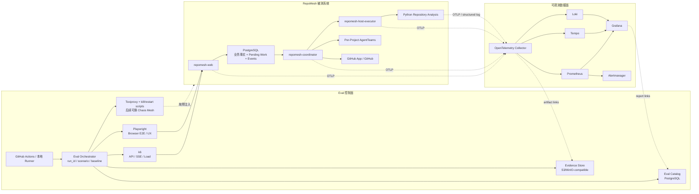
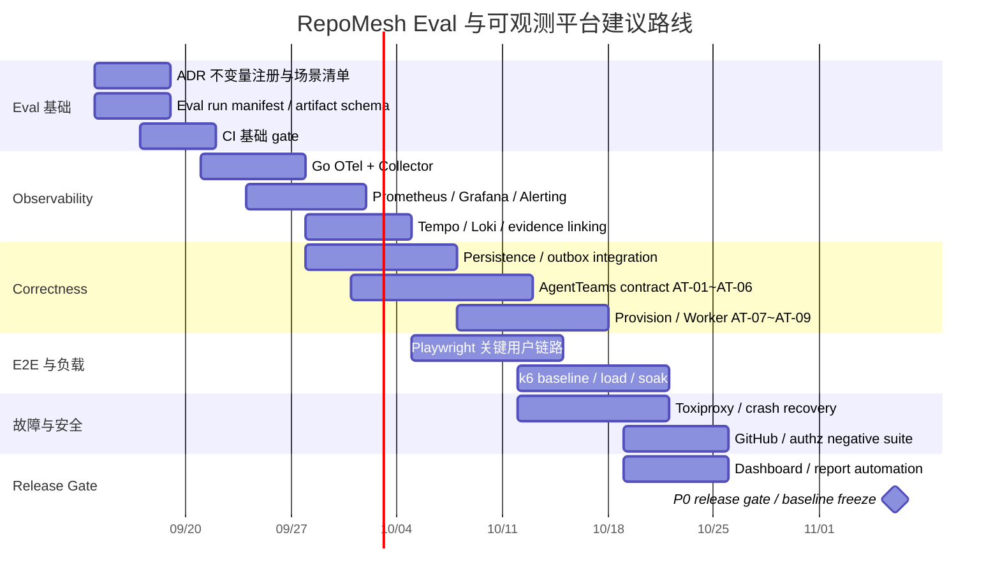

# RepoMesh Go 版架构审阅与可观测 Eval 平台设计报告

## 执行摘要

本报告基于对 `catbobyman/Repomesh_Go_ver` 仓库 `main` 分支的实际审阅。审阅快照对应提交 `4516805a276d65eb79490a12783654f3d7b1c677`，提交时间为 2026-09-11 09:45:43 UTC。当前 `main` 未启用 branch protection，也没有 required status checks，这是后续建立 eval release gate 时应优先修正的工程治理缺口。fileciteturn42file0

最重要的结论是：**RepoMesh 当前不是一个已经实现业务主链路、只缺测试的平台，而是一个“设计成熟度明显高于代码实现成熟度”的工程骨架。** 当前代码主要提供 React/TypeScript/Vite 静态前端、三个可编译的 Go 入口以及最小 Web HTTP 服务器；Issue、Plan、调度、权限、GitHub、AgentTeams、PostgreSQL/持久队列/对象存储、Graph、Python 仓库分析等核心业务能力尚未接入。`/healthz` 仅证明 Web 进程存活，`/readyz` 固定返回 503，业务 `/api` 尚未实现；Coordinator 和 Host Executor 默认明确退出为“未实现”。现有骨架的 `go build/test/vet`、前端 typecheck/build、静态浏览器渲染等已经通过，但仓库自己也明确警告“骨架完成不等于业务或 AgentTeams 集成验收完成”。fileciteturn8file0 fileciteturn14file0 fileciteturn17file0 fileciteturn35file0

因此，**最适合 RepoMesh 的 eval 不是等系统完成以后再做性能压测，而是现在就把 ADR 中的产品不变量、失败语义和安全边界转成“可执行规格（executable specification）”**。仓库已经有一份质量很高的 `agentteams-validation-plan.md`，其中 AT-01～AT-12 已覆盖锁版本契约、受控执行旁路、原生 DAG、陈旧写保护、身份映射、多 Issue 会话路由、首次准备与恢复、Worker 单活跃任务、多实例资源隔离、消息恢复、证据可信度和容量成本。真正应做的是把这些设计验证项直接纳入统一 eval 控制面，而不是另起一套互不相干的测试计划。fileciteturn19file1 fileciteturn19file0 fileciteturn19file4

从 ADR 看，RepoMesh 的核心设计可概括为五条必须被 eval 平台直接观测和验证的架构不变量：

1. **业务事实、运行事实、外部副作用必须分开。** Issue 创建成功不代表实例 Ready、消息已经被 Manager 处理、Worker 已派工、验证通过或交付完成；外部结果未知时应核查，而不是盲目重试。fileciteturn26file0 fileciteturn29file0  
2. **Conversation 是讨论载体，Issue 是交付边界。** 一个会话可以关联多条独立 Issue，共享聊天不能合并计划、执行、权限和 ChangeSet。fileciteturn29file0  
3. **执行控制必须落在真正产生副作用的位置。** 提示词、Agent 自觉遵守规则或“工具返回 2xx”都不足以证明权限、预算、容量和工作归属约束成立。fileciteturn33file0  
4. **资源预留、Attempt、Worker 单活和旧执行停止是安全不变量。** 超时不能被当成旧执行已消失，更不能据此立即释放 Worker/资源给新 Attempt。fileciteturn27file0  
5. **RepoMesh 本身负责跨仓业务编排，上游 AgentTeams DAG 负责受限仓内 DAG。** 上游 Project 按 Issue/仓库委派范围隔离，RepoMesh 负责跨仓依赖、下一轮、固定组合、计划权限与最终业务判断。fileciteturn24file0 fileciteturn25file0 fileciteturn34file0

据此，我建议采用以下 eval 技术栈：

**OpenTelemetry + Prometheus/Grafana/Alertmanager + Tempo/Loki + k6 + Playwright + Toxiproxy** 为第一阶段核心。OTel 负责统一 trace/metric/log 上下文，Prometheus/Grafana 负责 SLI/SLO、趋势和告警，k6 负责协议级负载与性能 gate，Playwright 负责浏览器 E2E 与原型 UX 回归，Toxiproxy 负责当前单机容器架构下可重复的网络故障。Chaos Mesh 很强，但其核心设计面向 Kubernetes CRD/DaemonSet，而 RepoMesh 当前明确以单机容器为一期目标，因此应作为未来 Kubernetes 化后的第二阶段选择，而不是现在的基础依赖。OpenTelemetry 本身是厂商中立的 telemetry 采集/处理框架；Prometheus/Grafana 可以完成时序指标、PromQL 与告警；k6 支持场景化负载与阈值直接决定测试退出状态；Chaos Mesh 则专门面向 Kubernetes 故障注入。citeturn0search1turn0search4turn1search2turn1search4turn0search0turn0search5turn2search3

在时间安排上，**eval 平台 MVP 可按 3～4 周、完整业务 eval 体系按约 8 周规划**，前提是假设有 2 名工程师持续投入；但“完整业务 E2E 通过”受产品实现进度约束，当前不应把 8 周误解为可以在业务代码尚未存在时完成真正的 RepoMesh 全链路验收。

## 仓库审阅与架构判断

审阅中应把仓库内容分成四个证据等级：**已接受设计、原型行为、有限运行验证、已实现产品代码**。RepoMesh 文档本身反复强调这四者不能互相替代，这一点对 eval 设计非常重要。ADR 的 `accepted` 只说明产品方向已经接受，不说明实现、部署或运行验收已经完成；原型页面也明确是内存模拟，不代表 API 或持久化语义。fileciteturn4file0 fileciteturn6file0

**重点审阅文件/目录与具体发现如下。**

| 路径 | 审阅发现 | 对 eval 的直接影响 |
|---|---|---|
| `README.md` | 当前被明确定位为 minimal engineering scaffold；三个 Go 入口可构建，业务与 AgentTeams 集成未实现；`healthz` 只代表进程存活，`readyz` 未实现。fileciteturn8file0 | 不能用现有 `go test ./...` 成功率作为产品正确性基线；必须建立“骨架 gate”和“业务 gate”两层。 |
| `CONTEXT.md` | 定义了 Project、Conversation、Issue、Repository Issue、Plan Version、Task、Attempt、Candidate、ChangeSet、Manager/Leader/Worker、房间等独立领域对象。fileciteturn9file0 | 应从领域关系直接生成 invariant 测试，尤其防止“会话=Issue”“房间=权限”“Task 完成=Issue 完成”等错误压平。 |
| `AGENTS.md` | 明确 `cmd/` 只组装入口、`internal/` 承载产品逻辑；`validation/` 是历史实验/证据，不属于产品构建；原型内存行为不能当 API 契约。fileciteturn10file0 | 新 eval 不建议继续放入历史 `validation/`；应新增 `eval/`、`tests/contract/`、`tests/e2e/` 等活动目录。 |
| `docs/adr/` | 共 20 份 ADR，已经形成较完整的执行、权限、事务、并发、会话、Graph/Loop 和插件边界。fileciteturn4file0 | ADR 应成为 eval requirement registry 的主要输入。 |
| `docs/current/architecture-design-v1.md` | 提议 Web / Coordinator / Host Executor 三类职责；业务持久化、外部适配、受控执行边界明确。fileciteturn21file0 | trace 必须跨三进程及外部 Adapter；性能不能只测 HTTP Web 层。 |
| `docs/current/technology-selection.md` | 已选 React+TS+Vite、Go、PostgreSQL、持久队列、REST+SSE、对象存储、单机容器和模块化单体，具体框架/库还有未冻结部分。fileciteturn20file0 | Eval 平台第一阶段也应尽量单机容器化，避免为测试先引入 Kubernetes。 |
| `docs/current/agentteams-validation-plan.md` | 已有 AT-01～AT-12 的验证设计，并明确“通过必须包括最终记录、真实资源和实际副作用”，不能仅以 HTTP/tool success 判定。fileciteturn19file1 fileciteturn19file4 | 应直接升格为 P0/P1 验收套件。 |
| `docs/prototypes/README.md` | 原型覆盖项目入口、模型配置、会话 dock、消息目标、Issue 创建/提交/DAG/详情、项目设置等；采用状态不一，而且全部是内存模拟。fileciteturn6file0 | UX eval 可以马上开始；业务 E2E 则必须等待真实 API。 |
| `docs/prototypes/repomesh-issue-modal-prototype.html` | 已表现“Issue 与会话分离”“Issue 创建不等于派工”“房间 Ready 单独表达”“页面创建可建立新会话”等关键语义，并明确无业务 API。fileciteturn40file1 fileciteturn40file2 | UI 测试重点应是用户是否理解这些状态边界，而非单纯像素回归。 |
| `docs/prototypes/repomesh-message-target-prototype.html` | 右侧查看某 Issue 不改变消息目标；有歧义时 Manager 询问目标，未澄清前不调整计划；创建结果未知时提示先查询、不要重复提交。fileciteturn41file2 fileciteturn41file3 fileciteturn41file5 | 这是 RepoMesh 最重要的 UX+安全联合 eval 场景之一，应验证“看哪里”和“改哪里”绝不能隐式等价。 |
| `internal/web/server.go` | 当前只有静态资源、health/readiness scaffolding、方法限制和 graceful shutdown；没有业务 handler。fileciteturn14file0 | 现阶段 Web 性能数据仅可作为 HTTP 基础开销基线。 |
| `internal/web/server_test.go` | 已覆盖 readiness scaffold、资源缺失和 graceful shutdown 的实际在途请求。fileciteturn15file0 | 测试风格是良好起点，可继续扩展到事务/恢复场景。 |
| `web/src/main.tsx` | 当前 UI 明确展示各核心模块“未实现”。fileciteturn17file0 | 不应把原型 HTML 与实际 React 产品页面混淆。 |
| `web/package.json` | 当前 React 19.3、TypeScript 7.0.2、Vite 8.2.2，已有 `typecheck` 与 `build`，还没有正式产品 E2E runner。fileciteturn36file0 | 推荐直接增加 Playwright 而不是自己编写浏览器驱动。 |
| `go.mod` | 根产品模块当前仅声明 Go 1.26，没有第三方 Go 运行依赖。fileciteturn37file0 | OTel 等依赖接入时要明确记录新增依赖和 telemetry overhead baseline。 |
| `third_party/agentteams-source.json` | AgentTeams 当前锁定 `517caff9280242a00a4d4c06365352b9e41659c6`，并明确只是独立上游 checkout，不代表产品集成验收。fileciteturn43file0 | 每次上游升级必须跑 contract eval；提交 SHA 是所有 AgentTeams 结果的必要环境指纹。 |
| `docs/current/scaffold-verification.md` | 当前骨架 build/test/vet、前端构建、浏览器 390px/桌面渲染均已做实际检查；但未启动 AgentTeams、DB、容器或模型服务。fileciteturn35file0 | 可作为 E0“工程骨架基线”，不能作为 E1+ 业务基线。 |
| Git 分支配置 | `main` 当前 `protected:false`，无 required checks。fileciteturn42file0 | eval 即使建立，如果不能阻断合并，就不是有效 release gate。 |

**ADR 决策地图与我的判断如下。**

| ADR 范围 | 核心架构决定 | Eval 应验证什么 |
|---|---|---|
| `0001 + 0018 + 0019` | 一项目一 AgentTeams 实例、长期 Manager/Team、Issue 工作隔离；Conversation 与 Issue 分离；首次消息或 Issue 建项提交后才异步准备实例。fileciteturn31file0 fileciteturn28file0 fileciteturn29file0 | 并发两个 Issue 是否串状态；同会话多 Issue 是否串计划；空项目是否错误启动实例；重复触发是否只复用一个项目实例。 |
| `0002` | GitHub App 安装权限只是上限；实际操作还受用户、项目、任务、仓库范围共同限制；默认 draft PR，人工合并。fileciteturn32file0 | App 有权限而用户无权限时必须失败；Agent 不得直推主分支/合并/越仓操作。 |
| `0003 + 0004 + 0006` | Plan 变更、验收语义、Manager 统一入口与 YOLO 自动模式有清晰边界。fileciteturn4file0 | 旧 Plan Version 不能继续生效；缺验收规则不能被误判为验证通过；自动化不扩大实际权限。 |
| `0005` | 验证组可选，但验证独立性与权限边界不因关闭常驻组而消失。fileciteturn4file0 | “Worker 自测”不能等价于正式验证；验证证据必须绑定固定候选组合。 |
| `0007 + 0014 + 0015` | RepoMesh Graph/Loop 运行于 Coordinator；复用上游有限 DAG；跨仓和后续轮次由 RepoMesh 管理。fileciteturn24file0 fileciteturn25file0 | DAG ready 不得绕过 RepoMesh 权限/容量/跨仓依赖；下一轮不得覆盖前一轮历史；replan 部分成功必须保留真实状态。 |
| `0008` | ChangeSet 是稳定归属/历史载体，候选、组合、交付记录不能被重试覆盖。fileciteturn4file0 | Retry/new Attempt 不得覆盖旧候选和证据；最终组合与验证结果必须可追溯。 |
| `0009` | Skill 工程整体暂缓。fileciteturn4file0 | 当前 eval 不应依赖“Skill 已实现”作为测试前置。 |
| `0010 + 0013 + 0020` | Go 模块化单体，拆 Web/Coordinator/Host Executor；额外允许受控 Python 分析进程。fileciteturn22file0 fileciteturn23file0 fileciteturn30file0 | 进程间身份/权限、故障恢复、Python CPU/内存/时限、Host Executor 允许列表和旁路必须验证。 |
| `0011 + 0012` | RepoMesh 必须在真正执行入口控制 AgentTeams；每个 Issue/仓库委派映射独立上游 Project。fileciteturn33file0 fileciteturn34file0 | 原生 MCP/REST/文件路径是否存在控制旁路；同 Team 的两个 Issue 是否出现 Project/task ID 串写。 |
| `0016 + 0017` | 业务事实与待办同 PostgreSQL 事务；外部调用在事务后；Attempt/Worker/容量原子预留，真正启动在事务外，启动前重校验。fileciteturn26file0 fileciteturn27file0 | Commit 后 crash 不丢工作；外部结果未知不重复副作用；Worker 绝无双重占用；超时后旧执行有写能力时禁止重新分配。 |

原型方面有一个尤其值得保留的设计优势：它们不是简单“Happy Path mockup”，而是主动表达 **saved、preparing、ready、delivered、received、unknown、clarifying、Issue created、plan available、Leader room available** 等不同状态。例如 Issue 原型把“消息已保存”“主房间已就绪”“已投递”“Manager 已接收”分别显示；消息目标原型又明确规定，右侧正在查看某 Issue 只改变查看上下文而不改变消息执行目标。fileciteturn40file2 fileciteturn41file2

这恰好说明 RepoMesh 的 eval 不能只围绕 HTTP 200、页面是否打开、任务最终是否“完成”。**真正的质量核心是：状态之间的因果关系有没有被错误折叠。**

## 评估方法与量化指标

首先需要明确当前尚未指定的输入。以下数值均为**建议的初始 eval 配置，不是已经确认的产品 SLA**。

| 输入 | 当前状态 | 建议起始范围 |
|---|---|---|
| 正式 SLA/SLO | **未指定** | API query p95 200～300 ms；command 持久提交 p95 300～500 ms；SSE 持久事件→浏览器 p95 ≤2 s；随后根据真实使用校准。 |
| 测试流量 | **未指定** | PR smoke：1～5 VU；nightly nominal：20～50 VU；pre-release：50～200 VU，并做 ramp 到饱和点。 |
| 同时活跃项目数 | **未指定** | 第一轮 1 / 2 / 5 / 10 项目阶梯。 |
| 每项目仓库数 | **未指定** | 1、2、5、10 仓；至少包含单仓、双仓依赖、五仓扇出三类。 |
| Worker 数/并发 Attempt | **未指定** | 每 Team 1～4 Worker；全机 2、4、8、16 并发 Attempt 阶梯。 |
| 仓库规模 | **未指定** | 小：≤50 MB；中：约 500 MB；大：1～2 GB checkout；Python 分析插件另测文件数量与 AST/关系规模。 |
| 预算/模型费用 | **未指定** | CI 默认使用 stub/fake model；nightly 小规模真实模型；release 手工批准真实模型预算。 |
| RTO/RPO | **未指定** | 业务已提交事实建议 RPO=0；单进程重启恢复目标 RTO ≤5 min；首次项目冷准备 p95 可先以 60～180 s 作为测量区间而非 SLA。 |
| Eval 数据保留 | **未指定** | 指标 15～30 天；trace/log 7～14 天；release evidence 90～180 天；安全与交付证据按项目审计需求延长。 |
| GitHub 测试环境 | **未指定** | 独立 test org + 专用 GitHub App + 至少“有权/无权/授权撤销/部分仓失效”四类仓库。 |
| AgentTeams 基线 | 已存在 | 固定 `517caff...` 作为当前 contract baseline，每个 eval run 记录 SHA。fileciteturn43file0 |
| 部署目标 | 一期单机容器 | Eval 环境先与产品一致；不要为了测试先引入 Kubernetes。fileciteturn31file0 fileciteturn20file0 |

建议将所有指标划分为 P0、P1、P2：**P0 是违反即阻断发布的业务/安全不变量；P1 是稳定性和服务质量 gate；P2 是趋势优化指标。** 性能阈值应在拿到真实基线后校准，而 P0 的“零容忍”指标现在就能冻结。

| 维度 | 指标与公式 | 采样/执行频率 | 建议阈值 | 优先级 |
|---|---|---|---|---|
| 功能正确性 | **ADR 不变量通过率** `IPR = passed_invariants / executed_invariants` | 每 PR；nightly 全集 | P0 不变量 **100%** | P0 |
| 功能正确性 | **端到端场景成功率** `ESR = successful_runs / valid_runs` | PR smoke；nightly ≥30 重复 | smoke 100%；nightly ≥99% 且无系统性失败 | P0/P1 |
| 功能正确性 | **重复副作用率** `DER = duplicate_external_effects / replayed_logical_ops` | 所有 retry/unknown-result 测试 | **0** | P0 |
| 功能正确性 | **目标安全率** `(正确绑定 + 正确澄清) / 目标相关消息数` | 每次多 Issue E2E | 100%；错误修改其他 Issue 数 **0** | P0 |
| 性能 | **Command commit p95** `Q0.95(t_response - t_request)`，仅计本地持久提交，不等待外部 AgentTeams | 每请求观测；15 s 聚合；每 PR perf-smoke | 建议 ≤500 ms | P1 |
| 性能 | **Query p95** | 同上 | 建议 ≤250 ms | P1 |
| 性能 | **SSE 传播 p95** `Q0.95(t_browser_receive - t_event_commit)` | 每事件；nightly | 建议 ≤2 s | P1 |
| 性能 | **首次准备 TTMR** `t_manager_room_ready - t_business_commit`，warm/cold 分开 | 每个首次准备 | warm 建议 ≤60 s；cold ≤180 s，先做基线再冻结 | P1 |
| 可扩展性 | **并发效率** `E(n)=throughput(n)/(n×throughput(1))` | 每晚阶梯负载 | 在计划并发区间建议 ≥0.8 | P1 |
| 可扩展性 | **饱和退化** `p95_load / p95_baseline` | 1×/2×/4×负载 | 2× nominal 时建议 ≤2，且错误率 <1% | P1 |
| 可扩展性 | **容量越界事件** `capacity_overcommit_total` | 每个预留/启动 | **0** | P0 |
| 可靠性 | **已提交业务丢失率** `committed_missing / committed_operations` | 每次 crash/restart chaos | **0** | P0 |
| 可靠性 | **恢复成功率** `recovered_faults / injected_recoverable_faults` | nightly chaos / release | ≥99%，关键持久化场景 100% | P0/P1 |
| 可靠性 | **未知结果错误重试率** `blind_retries / unknown_external_results` | 每次 timeout/断网 | **0**；必须先核查 | P0 |
| 可维护性 | **P0 ADR→测试覆盖率** `P0_requirements_with_tests / all_P0_requirements` | 每次 ADR/代码变更 | beta 前 100% | P0 |
| 可维护性 | **Flaky rate** `retry_passed / total_tests` | 每周滚动 | <1%；P0 测试要求 0 flaky | P1 |
| 可维护性 | **关键领域分支覆盖** | 每 PR | 建议 ≥85%；整体行覆盖 ≥70%，但不能替代 invariant gate | P2 |
| 安全性 | **越权实际副作用率** `unauthorized_effects / denied_requests` | 所有负面权限场景 | **0** | P0 |
| 安全性 | **跨项目/跨 Issue 泄漏数** | 每次隔离测试 | **0** | P0 |
| 安全性 | **Host Executor 非允许操作成功数** | 每 release security suite | **0** | P0 |
| 安全性 | **明文 secret 泄漏**，扫描 log/trace/artifact | 每 eval run + CI | **0** | P0 |
| 可观测性 | **关键流程 trace 覆盖率** `critical_ops_with_complete_trace / critical_ops` | 每 E2E run | eval 环境 ≥95%，P0 故障路径 100% | P1 |
| 可观测性 | **关联完整率** `records_with_trace_or_operation_link / observable_records` | nightly | ≥99% | P1 |
| 可观测性 | **telemetry 丢弃率** `dropped / received` | Collector 15 s | <0.1%；连续 >1 min 告警 | P1 |
| UX | **核心任务完成率** `completed_tasks / attempted_tasks` | 每次可用性批次 | ≥90%；安全相关任务 ≥95% | P1 |
| UX | **状态理解正确率**：能否正确回答“创建成功/房间 Ready/Manager 接收/执行开始是否等价” | 每批 UX eval | ≥95% | P1 |
| UX | **错误目标操作率** | 多 Issue 用户任务 | **0** | P0 |
| UX | **任务耗时相对基线** `(candidate_median-baseline_median)/baseline_median` | 原型 A/B | 不退化 >10%；目标改善 ≥20% | P2 |

性能分布建议使用 histogram 而不是把客户端预计算的 p95 当成可聚合时序数据；Prometheus 官方文档也强调 histogram 可在服务端按时间窗口和实例聚合计算 quantile，而直接平均预计算 quantile 在统计上是不成立的。citeturn3search2

Prometheus 指标标签必须控制基数。建议允许 `service`、`operation`、`outcome`、`reason_class`、`scenario_class`、`baseline` 等有限集合，**禁止把 `user_id`、`issue_id`、`attempt_id`、`trace_id`、Git SHA 之外的任意不受限 ID 直接作为长期 Prometheus label**；Prometheus 官方同样警告，每一种 label value 组合都会创建新的 time series，高基数 ID 会显著扩大存储。细粒度 ID 应进入 trace/log/eval 数据库。citeturn3search0

## 实验设计与自动化

RepoMesh 已有 AT-01～AT-12 验证计划，应把它们转成以下测试金字塔，而不是把“unit/integration/E2E/load/chaos”各自孤立建设。现有计划特别正确的一点是：测试结果必须核查最终持久记录、上游实际状态、外部副作用、故障后的恢复状态，不能以 HTTP 2xx 或 Agent 文字回复充当成功证明。fileciteturn19file1 fileciteturn19file4

| 测试层 | RepoMesh 具体内容 | 典型失败注入/Oracle |
|---|---|---|
| 单元测试 | Conversation/Issue 关联；Plan Version 状态机；Attempt reservation；Worker 单活；预算/权限判断；Graph 跨仓 dependency；idempotency key；ChangeSet 历史 | 状态机 transition 是否被拒绝；重复操作是否保持原 operation/result |
| 属性/不变量测试 | 任意事件序列下“一个 Worker ≤1 活跃 Attempt”“Issue A 事件不得改变 Issue B Plan”“未授权动作无副作用”等 | 随机生成事件序列，最终数据库 invariant 查询 |
| 数据库集成 | PostgreSQL 事务 + durable pending work；Issue+ChangeSet+Conversation 来源原子创建；SSE 持久事件 | commit 前 crash、commit 后 crash、重复 consumer、DB timeout |
| AgentTeams contract | 锁定 SHA 下 Controller/TeamHarness/MCP/DAG/Project 真实行为 | 对照 AT-01～AT-05；REST 与 MCP 并发；旧 plan write；ID collision |
| GitHub App 集成 | 用户权限∩App 安装∩项目范围∩任务范围 | 用户失权、仓库授权撤销、部分仓失效、merge/主分支写入拒绝 |
| Host Executor 集成 | allowlist、mount、network、CPU/mem、Attempt clone | 越界 mount、旧 Attempt 未停、超时后重新分配 |
| Python 分析插件 | 固定输入→候选仓/关系/证据/coverage，资源限制和失败 fallback | timeout、OOM、恶意文件名、超大 repo、插件 crash |
| 浏览器 E2E | project → conversation → message → issue → unknown result → room nav → target clarification | 页面刷新、SSE 中断、网络重连、返回/侧栏切换 |
| 负载测试 | API、SSE、issue create、message append、queue pickup、cold/warm provision | ramp、constant arrival rate、burst、soak |
| 混沌测试 | Web/Coordinator/AgentTeams/DB/object store/network/process restart | kill -9、延迟、断链、半开连接、响应丢失、恢复 |
| UX eval | 项目创建、Issue 创建、多 Issue 对话、消息歧义、unknown-result 恢复、DAG/Leader room 导航 | 任务成功率、时间、错误目标、状态理解测验 |

其中几个场景应直接成为 **P0 Release Scenarios**：

**事务与重复请求。** 请求创建 Issue，本地事务成功后在 HTTP 响应返回前杀死 Web；客户端看到 timeout 后重试。最终只能存在一个逻辑 Issue、一个主 ChangeSet、正确的 Conversation 关联和一个可查询 idempotency result。该场景直接检验 ADR-0016 的核心意义。fileciteturn26file0

**首次准备竞态。** 同一个尚未运行的 Project 同时发生“首条 Conversation message”和“页面创建 Issue”，Coordinator 又因为 crash 重领任务。最终应该汇合到同一个 Project 实例准备过程，而不是创建多个 AgentTeams 实例；每个 Conversation/Issue 的业务事实仍保持独立。此场景已经在 AT-07 中被列为 P0。fileciteturn19file0 fileciteturn28file0

**Worker 旧执行。** Attempt A 启动后 Host Executor 请求超时，但真实进程仍在工作；Coordinator 不得因为 timeout 把 Worker 释放给 Attempt B。只有证明 A 已失去写能力/实际停止后才能重新分配。这既是可靠性测试也是安全测试。fileciteturn27file0

**多 Issue 消息目标。** Conversation 同时关联 Issue A 和 B，用户当前右侧正在查看 A，却发送“这个也增加日期范围”；系统不能以当前页面为执行授权，应澄清目标。原型已经明确表达“右侧查看范围不会代替消息目标”，ADR-0019 也要求不能从当前打开页面猜执行归属。fileciteturn41file2 fileciteturn29file0

**GitHub 权限交集。** App installation 可写仓库，但当前用户没有相应权限，或者用户权限在排队后、实际执行前被撤销；实际副作用必须为零。fileciteturn32file0 fileciteturn33file0

**数据集与环境建议。**

建立一个专用 `repomesh-eval-fixtures` GitHub 组织，至少准备以下 fixture 关系：

```text
frontend-app ─────► api-contract
      │                 │
      └────► shared-lib ◄┘
                       │
                backend-service
                       │
                    migrations
```

每个仓准备固定 tag/commit，并包含：可并行变更、前后端 API 依赖、循环依赖候选、故意失败测试、Git 权限受限分支、历史数据兼容场景。这样同一个 fixture 能覆盖单仓、跨仓 DAG、fixed combination、replan、部分成功和 draft PR。

仓库分析插件再增加三档 corpus：约 50 MB、500 MB、1～2 GB checkout，并混入 symlink、binary、generated/vendor 目录、深路径、异常编码和超大文件；Oracle 不要求推荐结果“完全一致”，而是要求固定版本插件对固定输入可复现、覆盖说明完整、超时后不会改变 Issue scope，且失败后仍允许用户手选仓库，这与 ADR-0020 的辅助建议定位一致。fileciteturn30file0

**流量模型。** k6 的 `scenarios` 可以为不同 workload 配置独立 VU/iteration/arrival 模式和 tags，并可并行或按 `startTime` 编排；threshold 则能把错误率和 p95 等标准直接转成测试退出状态，因此很适合 CI gate。citeturn0search0turn0search5

建议至少运行：

```javascript
import http from 'k6/http';

export const options = {
  scenarios: {
    nominal_commands: {
      executor: 'constant-arrival-rate',
      rate: 20,
      timeUnit: '1s',
      duration: '10m',
      preAllocatedVUs: 20,
      maxVUs: 100,
      tags: { workload: 'nominal' },
    },
    burst_queries: {
      executor: 'ramping-arrival-rate',
      startTime: '2m',
      startRate: 20,
      timeUnit: '1s',
      stages: [
        { target: 100, duration: '2m' },
        { target: 100, duration: '3m' },
        { target: 20, duration: '1m' },
      ],
      preAllocatedVUs: 50,
      maxVUs: 200,
      tags: { workload: 'burst' },
    },
  },
  thresholds: {
    http_req_failed: ['rate<0.01'],
    'http_req_duration{expected_response:true}': ['p(95)<500'],
  },
};

export default function () {
  http.get(`${__ENV.BASE_URL}/api/eval/read-path`);
}
```

k6 官方将 threshold 定义为测试 pass/fail 条件，并会在 threshold 失败时以非零状态退出，非常适合自动化 release gate。citeturn0search0

**对照组与统计方法。**

性能实验应至少记录三个基线：

`B-main`：当前 `main` 的上一稳定 eval baseline；  
`B-direct`：在专门的 Adapter overhead 测试中直接调用锁定的 AgentTeams，与经过 RepoMesh controlled adapter 比较；该基线只用于量化控制开销，不能作为安全正确性的对照；  
`B-no-otel`：仅在专项 benchmark 中关闭 telemetry，用于测量观测开销，不作为生产配置。

对 latency/throughput 的候选与基线比较，不建议把一次压测中的数百万 HTTP request 当成数百万独立样本。更稳妥的方法是进行至少 5～10 个独立 run，对 run-level p50/p95/goodput 做 bootstrap 95% CI；Release 性能 gate 可定义为：

\[
Regression =
\frac{p95_{candidate}-p95_{baseline}}
{p95_{baseline}}
\]

推荐只有在 **95% CI 的上界也超过 +10%** 时才判定明确性能退化；否则保留为趋势告警而非硬 gate。

比例类结果如 UX completion、错误率，可在样本足够大时用 χ² 检验，稀疏数据用 Fisher exact test；非正态任务耗时采用 Mann–Whitney U，若同一批受试者对比两个原型，则采用配对的 Wilcoxon signed-rank。统一 `α=0.05`，同一批次大量指标比较时使用 Holm 校正，同时报告 effect size 和置信区间，不只报告 p-value。

对于必须为零的安全/一致性缺陷，不应用“统计不显著”放行。例如 unauthorized side effect、跨 Issue 串写、Worker 双占用，观察到一次即失败。若要以零失败样本估计稀有失败率，可用近似 “rule of three”：0 次失败、约 300 次独立试验只能支持 95% 置信下失败率大约低于 1%；要逼近 0.1% 则需要约 3000 次独立试验。

**重复性要求。** 每个 eval run 至少保存：

```text
eval_run_id
RepoMesh commit SHA
AgentTeams commit SHA
frontend lockfile hash
Go / Node / npm version
OS / container image digest
DB schema version
feature flags
scenario version
fixture repo commits
model/provider or stub version
fault-injection seed
load profile
start/end timestamp
all pass/fail assertions
artifact index
```

这与仓库现有验证计划要求记录版本、镜像、配置、业务/上游 ID、请求响应、事件、状态读回、日志、实际副作用、故障和恢复证据的原则一致。fileciteturn19file4

## 可观测 Eval 平台设计

建议把平台设计为两个相互关联、但逻辑独立的部分：

**SUT Observability Plane**：回答“RepoMesh 实际发生了什么”；  
**Eval Control Plane**：回答“在什么 commit、环境、场景和故障下，它是否符合 ADR/SLO”。



OpenTelemetry 很适合作为这一架构的统一 instrumentation 层：它是厂商中立的 telemetry 框架，覆盖 traces、metrics、logs，Collector 又可以统一 receive/process/export，不要求各进程直接绑定具体可观测后端；当前 Go OTel 文档中 traces 和 metrics 均为 stable。citeturn0search1turn0search4turn3search1

Prometheus/Grafana 负责 SLI、趋势和 release dashboard。Grafana 原生支持 Prometheus 数据源、PromQL、alerting、recording rules 和 exemplars；Prometheus Alertmanager 再负责通知聚合、route、mute/inhibition 等。citeturn1search4turn1search2turn1search0

Tempo/Loki 建议作为可选但很有价值的 trace/log backend。Tempo 可以使用 S3-compatible object storage（例如 MinIO）保存 trace，与 RepoMesh 设计中的对象存储方向吻合；Grafana 支持从 trace 关联 metrics/logs。Loki 则可在 Grafana 中统一检索 structured logs。citeturn4search1turn4search3turn4search6

**工具比较与选型。**

| 工具 | 主要用途 | 优点 | 局限 | RepoMesh 集成方式 | 建议 |
|---|---|---|---|---|---|
| **OpenTelemetry SDK + Collector** | 跨 Web/Coordinator/Executor/Python 的 trace、metric、log 上下文 | 厂商中立；统一收集/处理/export；Go trace/metric 成熟。citeturn0search4turn3search1 | 不是长期存储和 dashboard；仍需后端 | Go 进程 OTLP；Python plugin OTLP；Collector 统一 resource attrs | **核心必选** |
| **Prometheus + Grafana + Alertmanager** | SLI/SLO、dashboard、PromQL、告警 | 时序指标和 PromQL 成熟；Grafana 原生 Prometheus 支持；Alertmanager 提供通知路由。citeturn1search4turn1search2turn1search0 | 不适合保存单次 Attempt/Issue 等高基数细节；trace/log 需额外 backend | Prometheus scrape OTel/app metrics；Grafana provision dashboard/rules | **核心必选** |
| **k6 OSS** | API/SSE 负载、性能回归、soak、容量 | Scenario 可精细建模流量；threshold 可直接决定 CI 成败。citeturn0search0turn0search5 | 不是业务状态 Oracle；浏览器 UX 不如 Playwright | `eval/k6`；输出 CI summary；可选 Prometheus remote write | **核心必选** |
| **Playwright** | 浏览器 E2E、原型回归、交互与无障碍辅助检查 | CI 失败可以保留 trace，包含 DOM snapshot、network、console、action；适合现有 React 与 HTML 原型。citeturn2search0turn2search8 | 不代替后端负载测试；浏览器 E2E 易产生 flaky，需要状态隔离 | `eval/playwright`; failure trace 上传 evidence store | **核心必选** |
| **Toxiproxy** | DB/AgentTeams/GitHub mock/Object store 网络故障 | 可在测试/CI 中确定性修改 TCP 连接，符合当前单机容器环境。citeturn2search7 | 主要是网络故障，不能完整模拟 CPU/进程/磁盘 | 所有测试外部连接经 proxy；脚本按 run_id 配置 latency/reset | **第一阶段混沌首选** |
| **Chaos Mesh** | Kubernetes 网络、Pod、资源、磁盘等综合 chaos | 故障类型丰富，支持 Workflow 串/并行编排；Kubernetes CRD 原生。citeturn2search3turn2search6 | 核心架构依赖 Kubernetes/DaemonSet，当前 RepoMesh 一期是单机容器，因此引入成本明显偏高。citeturn2search10 fileciteturn31file0 | 未来 K8s 化后将当前 chaos scenario 翻译成 CRD Workflow | **二期** |

关于 k6 的指标接入，需要特别注意：当前官方 Prometheus remote-write output 仍标为 experimental，因此建议 **CI pass/fail 以 k6 本地 threshold/summary 为权威**，Prometheus remote write 只作为方便的趋势可视化通道，而不是唯一证据存储。k6 支持通过 `testid` 划分测试 run，但如果每次 run 都作为长时间保留的 Prometheus label，会和 Prometheus 的高基数最佳实践产生冲突；建议仅短期保留此类序列，长期的 `eval_run_id` 放到 Eval Catalog、trace 和日志中。citeturn0search2turn3search0

**RepoMesh telemetry schema 应围绕领域状态，而不是代码函数名设计。**

推荐业务指标：

```text
repomesh_business_operations_total{
  operation="issue_create|message_append|plan_activate|attempt_reserve",
  outcome="success|rejected|unknown"
}

repomesh_pending_work_total{kind,state}
repomesh_pending_work_oldest_age_seconds{kind}

repomesh_external_operations_total{
  system="agentteams|github|host_executor|repository_analysis",
  operation,
  outcome="success|rejected|unknown"
}

repomesh_attempt_transitions_total{from,to,reason_class}
repomesh_resource_reservations{resource_type,state}

repomesh_invariant_violations_total{invariant}
repomesh_authz_denials_total{operation,reason_class}
repomesh_authz_bypass_detected_total{boundary}

repomesh_message_delivery_total{
  stage="saved|delivery_requested|delivered|manager_received",
  outcome
}

repomesh_issue_create_duration_seconds
repomesh_message_delivery_lag_seconds
repomesh_project_prepare_duration_seconds{mode="warm|cold"}
repomesh_pending_work_pickup_seconds
```

Traces 则应按业务操作展开：

```text
IssueCreate
  ├─ AuthorizeProjectScope
  ├─ DB.Transaction
  │   ├─ InsertIssue
  │   ├─ InsertMainChangeSet
  │   ├─ LinkConversation
  │   └─ EnqueuePendingWork
  └─ HTTP.Response

AsyncPrepare
  ├─ LoadCommittedOperation
  ├─ RecheckAuthBudgetCapacity
  ├─ AgentTeams.LookupExistingInstance
  ├─ AgentTeams.PrepareOrRecover
  ├─ VerifyManagerReady
  ├─ VerifyRoomReady
  └─ DeliverOrAdoptBusinessWork
```

这和 ADR-0016/0018 的因果链完全吻合：创建事务结束于“业务事实与待办已保存”，而不是结束于“Manager 已工作”。fileciteturn26file0 fileciteturn28file0

建议所有业务 trace 都带低风险属性：

```text
service.name
service.version
deployment.environment
repomesh.operation.type
repomesh.project_class
repomesh.trigger
repomesh.result_class
repomesh.eval.scenario
repomesh.baseline
```

具体 `issue_id`、`operation_id` 等只放 trace/log，并根据权限做脱敏。**不要把 GitHub token、模型 API key、用户凭据或敏感业务文本放进 OTel Baggage。** OTel 官方文档明确说明 Baggage 会随网络请求传播，而且没有内建完整性保证，因此包含敏感值存在泄漏和信任风险。citeturn3search5

## 实施计划、示例面板与告警

由于当前代码仍处于 scaffold 阶段，实施应采用 **“先建立测量骨架 → 再把每个业务 vertical slice 接入同一个 eval harness”** 的方式，而不是一次性建设一个庞大的独立测试平台。

建议在仓库新增：

```text
eval/
  manifest/
    scenarios.yaml
    invariants.yaml
  k6/
    api-smoke.js
    command-load.js
    sse-soak.js
  playwright/
    project-entry.spec.ts
    issue-create.spec.ts
    multi-issue-target.spec.ts
    unknown-result.spec.ts
  chaos/
    toxiproxy/
    process-kill/
  fixtures/
    README.md

tests/
  contract/
    agentteams/
    github/
  integration/
    persistence/
    coordinator/
    hostexecutor/
  e2e/

internal/
  telemetry/
  evalcontext/

deploy/eval/
  compose.yaml
  otel-collector.yaml
  prometheus.yaml

observability/
  rules/
    repomesh.rules.yml
  dashboards/
    control-plane.json
    business-flow.json
    execution-safety.json
    eval-runs.json
```

不建议把新活动测试继续放入现有 `validation/`，因为仓库工程规范已经把该目录定义为历史实验和证据、并从产品构建隔离。fileciteturn10file0 fileciteturn35file0

**推荐时间表如下，日期以 2026-09-14 开始计算。**



这张图的“完成”指 eval 能力完成；若相应 RepoMesh 业务模块尚未实现，对应测试应该以 **blocked/not implemented** 明确记录，而不是通过 mock 将其伪装成业务通过。

**阶段产出和人员/基础设施估算：**

| 阶段 | 主要交付 | 估算 |
|---|---|---:|
| Eval 契约基础 | ADR→invariant registry、scenario manifest、eval run schema、Junit/JSON 报告 | 1 周 |
| Observability MVP | OTel、Prometheus、Grafana、4 个 dashboard、初始 alerts | 1～2 周 |
| P0 correctness harness | DB transaction、idempotency、AgentTeams contract、Worker reservation | 2～3 周 |
| E2E/UX/load | Playwright、k6、fixtures、baseline comparison | 2 周 |
| Chaos/security/release | Toxiproxy、restart suite、GitHub 权限负面测试、release gate | 1～2 周 |

按 2 名熟悉 Go/TS 的工程师并行工作，约 8 个自然周较合理；GitHub App 权限、AgentTeams 真实运行和 Host Executor 的深入安全验证最好再安排独立 reviewer。该估算不包括核心 RepoMesh 业务模块本身的开发。

**CI/CD 应至少拆成三个 workflow 层级：**

```text
PR:
  go build / go test / go vet
  npm ci / typecheck / build
  domain unit
  invariant/property tests
  contract smoke
  Playwright smoke

Nightly:
  PostgreSQL integration
  AgentTeams contract full
  k6 nominal + burst
  message/SSE recovery
  Toxiproxy chaos
  30x critical race/recovery repetitions

Release:
  all P0 AT scenarios
  GitHub test-org authorization matrix
  cold/warm provisioning
  worker/capacity race
  full browser E2E
  sustained load / soak
  security negative suite
  baseline regression comparison
```

由于当前 `main` 未受保护、required checks 为空，第一阶段完成后应该马上把 `build`, `unit-invariants`, `contract-smoke`, `e2e-smoke` 设为 mandatory checks；否则测试失败并不能真正阻止不合格代码进入主分支。fileciteturn42file0

**Grafana 面板建议分成四张，而不是一张“大盘”。**

| Dashboard | 关键图表 |
|---|---|
| **RepoMesh Control Plane** | Web/Coordinator/Executor availability；HTTP RPS/error/p50/p95/p99；DB transaction latency；pending work depth/oldest age；Coordinator pickup latency；process restart count；OTel export failures |
| **Business Flow** | Issue create funnel：request→committed→pending work→instance ready→room ready→Manager adopted；message：saved→delivery requested→delivered→received；各状态 p50/p95 等待时间；unknown-result backlog |
| **Execution Safety** | active/reserved Attempt；capacity usage；reservation timeout；permission denials；authz bypass；stale Plan rejection；old Attempt shutdown；invariant violations；cross-project isolation failures |
| **Eval Runs** | main vs candidate pass rate；scenario heatmap；p95 delta；throughput delta；flaky tests；chaos recovery rate；latest failing commit；artifact/trace links |

Prometheus/Grafana 对 latency 建议使用 histogram，并通过 PromQL 计算 p95；Grafana/Prometheus 可以直接对这些时序数据做 dashboard 和 alert。citeturn3search2turn1search4

以下 PromQL 假设采用前述自定义 metric 命名。

**HTTP 错误率超过 1%：**

```promql
sum(rate(repomesh_http_requests_total{status_class="5xx"}[5m]))
/
clamp_min(
  sum(rate(repomesh_http_requests_total[5m])),
  1
)
> 0.01
```

建议 `for: 5m`，P1。

**Command p95 超过建议 500 ms：**

```promql
histogram_quantile(
  0.95,
  sum by (le, operation) (
    rate(repomesh_command_duration_seconds_bucket[5m])
  )
)
> 0.5
```

Prometheus 官方说明 alerting rule 可以用 PromQL expression，并通过 `for` 避免短暂瞬态直接 firing；Alertmanager 再负责通知聚合和路由。citeturn1search2turn1search0

**Pending work 最老任务超过 30 秒：**

```promql
max by (kind) (
  repomesh_pending_work_oldest_age_seconds{state="ready"}
) > 30
```

对普通任务建议 P1；对于会阻塞用户首条消息/Issue 创建后的准备链路，可以提升严重度。

**任何业务 invariant 被破坏：**

```promql
increase(repomesh_invariant_violations_total[5m]) > 0
```

P0，`for: 0m`，应立即通知并把相应 eval run 判失败。

**发现权限控制旁路：**

```promql
increase(repomesh_authz_bypass_detected_total[5m]) > 0
```

P0，不做容忍窗口。

**外部操作结果持续 Unknown：**

```promql
sum by (system, operation) (
  repomesh_external_operation_unknown{state="unresolved"}
) > 0
```

可以进一步结合 age：

```promql
max by (system, operation) (
  repomesh_external_operation_unknown_age_seconds
) > 60
```

这不是说 60 秒后应该盲目重试，而是提醒系统的核查/恢复链路已经超出目标；ADR-0016 明确要求外部结果未知时先确认实际结果。fileciteturn26file0

**SSE p95 传播时间：**

```promql
histogram_quantile(
  0.95,
  sum by (le) (
    rate(repomesh_sse_delivery_lag_seconds_bucket[5m])
  )
) > 2
```

**Telemetry 出口失败：**

```promql
rate(otelcol_exporter_send_failed_spans[5m]) > 0
```

具体 Collector 内部 metric 名需要按最终使用版本在部署时固定；OTel Collector 本身暴露内部 telemetry，可用于监测 Collector 是否正在丢弃或无法发送数据。citeturn0search9

自动报告建议在每个 eval run 结束后生成一个 `report.json` 与 Markdown summary：

```json
{
  "run_id": "eval-2026-10-20-main-0042",
  "commit": "abc123...",
  "baseline": "def456...",
  "environment": "eval-single-host-v1",
  "scenarios": {
    "P0": {"passed": 47, "failed": 0, "blocked": 2},
    "P1": {"passed": 83, "failed": 1, "blocked": 3}
  },
  "performance": {
    "command_p95_ms": 312,
    "baseline_p95_ms": 298,
    "delta_ratio": 0.047
  },
  "invariant_violations": 0,
  "unauthorized_side_effects": 0,
  "artifacts": [
    "playwright-trace",
    "otel-trace-index",
    "k6-summary",
    "chaos-timeline"
  ]
}
```

其中 `blocked` 必须和 `failed`、`passed` 分开。对于目前尚不存在的 Coordinator/Host Executor/业务 API，最诚实的结果是 `blocked:not_implemented`，而不是用 mock 使 release dashboard 全绿。

## 风险、限制与结论建议

**第一项限制是实现成熟度。** 当前 RepoMesh 已经有相当深入的 ADR、专题设计和历史 AgentTeams 验证，但产品代码仍主要是 scaffold；现有实际验证覆盖构建、Web 静态服务、readiness 语义和浏览器基础渲染，不覆盖真正 Issue/Plan/调度/GitHub/AgentTeams/数据库业务链路。fileciteturn35file0 因而本文提出的很多指标是未来业务实现时的 release criteria，而不是今天已经可以跑出可信数值的 benchmark。

**第二项风险是把上游验证误认为 RepoMesh 验证。** 现有 AgentTeams 历史验证包含大量真实 HTTP、SA、fixture 和 S3 evidence，但仓库自己明确将这些结果界定为组件级证据而非 RepoMesh 受控执行全链路验收。后续每一条 contract test 都应该保留这个区分：`native upstream support`、`needs RepoMesh adapter`、`needs upstream patch`、`not supported` 和 `not run` 不能被压缩成简单 pass/fail。fileciteturn19file4

**第三项风险是可观测系统反过来破坏安全边界。** RepoMesh 本身涉及 GitHub 凭据、模型 API Key、代码内容、用户消息、计划和执行结果；trace/log 采集不能把 secret 或完整敏感 prompt 无条件上传。OTel Baggage 特别不适合承载这类秘密信息，因为它会随上下文传播到下游。citeturn3search5 应实行字段 allowlist、默认脱敏、artifact ACL 和 eval/test-only correlation header。

**第四项风险是高基数。** RepoMesh 的自然领域里到处都是 project/issue/task/attempt/message/changeSet/room ID，如果不加设计就全部塞进 Prometheus label，平台很容易在真正承载业务前就先被时序基数拖垮。Prometheus 官方明确建议避免 user ID、email 等高基数 label，同理 RepoMesh 的各类随机业务 ID 也应放到 trace/log/SQL，而不是 metrics label。citeturn3search0

**第五项风险是混沌测试选型错位。** Chaos Mesh 本身非常适合 Kubernetes，而且提供 CRD、Workflow 和丰富 fault 类型，但当前 RepoMesh 一期已经明确使用单机容器。citeturn2search3turn2search6 fileciteturn31file0 因此当前先用 Toxiproxy + process/container kill + filesystem/resource scripts，等产品真的迁移 Kubernetes 后再把同一 scenario catalog 映射到 Chaos Mesh，能避免平台先于产品架构过度工程化。

**第六项风险是把性能目标定得过早。** 当前用户量、项目数量、仓库大小、机器规格、Worker 数、模型延迟和正式 SLA 都是未指定。本文的 250 ms、500 ms、2 s、60/180 s 等只能作为起步建议。真正 freeze SLO 应先获得至少一个版本的真实 workload baseline，然后结合成本预算决定。

**第七项风险是 CI 本身缺少强制性。** 当前 `main` 没有 branch protection 或 required checks。fileciteturn42file0 因此平台建设第一批产出不应该只是漂亮 Grafana，而应同时建立 merge gate。否则“有 eval”与“eval 能保护架构”是两回事。

综合仓库设计、现有实现和验证基础，我建议按以下优先级推进：

| 顺序 | 建议 | 原因 |
|---|---|---|
| **最高** | 把 AT-01～AT-09 与 ADR-0016/0017/0018/0019 的关键约束整理成 `invariants.yaml + executable tests` | 这些约束决定系统是否安全、正确，远比早期吞吐数字重要。fileciteturn19file1 |
| **最高** | 第一个业务 vertical slice 开发时同步接 OTel，不要事后补埋点 | Web→DB→Coordinator→AgentTeams/Executor 的因果关系是 RepoMesh 的核心产品能力。 |
| **最高** | 建立 branch protection 和 P0 status checks | 当前 main 没有强制检查。fileciteturn42file0 |
| **高** | 用 PostgreSQL 建 Eval Catalog，用对象存储留 evidence；Prometheus 只保存低基数 SLI | 与 RepoMesh 已选基础设施方向一致，也避免 metrics 被业务 ID 污染。fileciteturn20file0 |
| **高** | Playwright 直接覆盖现有采用原型的“认知边界” | 原型真正价值在状态语义，而不只是布局；尤其要测“创建≠Ready”“查看 Issue≠消息目标”。fileciteturn6file0 fileciteturn41file2 |
| **高** | k6 建立 nominal/burst/soak baseline，但在业务实现完成前不把 scaffold 性能包装成产品 SLA | k6 threshold 很适合 CI gate，但当前业务路径尚不存在。citeturn0search0turn0search5 |
| **中** | 当前采用 Toxiproxy，未来 Kubernetes 化后再引入 Chaos Mesh | 与产品一期部署拓扑匹配。citeturn2search7turn2search3 |

最终判断是：**RepoMesh 目前最有价值的资产不是已经实现的代码，而是 ADR 中对“权限、事务、归属、恢复、并发和状态真实性”的精细区分。Eval 平台的首要任务就是防止这些区分在工程实现中逐步丢失。**

尤其建议把下面这条原则作为整个平台的顶层验收定义：

\[
\boxed{
\text{Eval Pass}
=
\text{业务记录正确}
\land
\text{权限/资源不变量成立}
\land
\text{真实外部副作用正确}
\land
\text{故障恢复后的最终状态正确}
\land
\text{可追溯证据完整}
}
\]

而不是：

\[
\text{HTTP 2xx}
\Rightarrow
\text{Pass}
\]

这其实也是仓库现有验证计划已经体现出的核心思想：一次工具调用成功、Agent 说“完成”、上游任务显示 completed，甚至 Issue 创建成功，都不足以证明 RepoMesh 的业务目标已经满足；必须读回最终状态、核对实际资源与副作用，并保留可追踪证据。fileciteturn19file4 fileciteturn29file0

如果按这一原则实施，RepoMesh 的 eval 平台就不会只是普通的“Prometheus 监控 + k6 压测”，而会成为一套真正能够持续验证 ADR 是否仍然成立的**架构符合性、业务正确性、运行安全性和服务质量统一评估系统**。